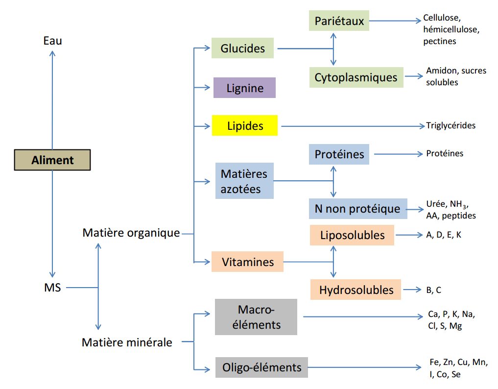

# Rappels sur les aliments{#rappels}

Les aliments peuvent être classés selon les nutriments principaux qui les composent et qu'ils apportent dans la ration à savoir ceux qui fournissent l’**énergie**, les sources de **protéines**, de **calcium**, de **phosphore**, les autres **macroéléments**, les **oligo-éléments** et les **vitamines**.

##	Les sources d’énergie

Les **céréales** sont généralement la principale source d’énergie des provendes. Le **maïs** est plus énergétique que le **mil**, le **sorgho** ou le **blé**. Les **farines basses** de **riz** et de **blé** (*les remoulages*) ont également une bonne valeur énergétique.

Les **sons** ont une teneur (*concentration*) moyenne en énergie, mais sont indispensables pour régulariser le transit digestif chez la volaille.

Les **huiles végétales** et les **graisses animales** constituent quant à elles, des sources d’énergie pratiquement pure et sont utilisées dans les régimes nécessitant une valeur énergétique élevée.

##	Les sources de protéines

Les **tourteaux** (_résidus d'extraction d'huile: soya, arachide, coton, palmiste, etc._) apportent la majorité des protéines de la ration. La **farine de poisson** est une excellente source de **protéines** riche en **lysine** et en **méthionine**.

La **lysine** et la **méthionine** de synthèse sont généralement incorporées aux mélanges pour satisfaire les besoins en ces deux acides aminés essentiels qui sont généralement trop peu présents dans les matières premières.

##	Les sources de calcium et de phosphore

La **craie** (_carbonate de calcium_), les **phosphores**, les **coquillages** broyés, les **coquilles** d’huîtres et les **poudres d’os** sont utilisées. Les **concentrés minéraux du commerce** apportent également ces éléments en quantités variables.

##	Les autres macroéléments, les oligo-éléments et les vitamines

Les **concentrés minéraux-vitamines** (CMV) du commerce sont la principale source de ces différents éléments, et sont généralement incorporés à des doses qui varient entre 0,5 et 5% de la ration.

## Compositon des aliments

Les aliments distribués aux bovins, simples ou mélangés, sont composés d’**eau** et de divers **nutriments** (_glucides, lipides, matières azotées, vitamines et minéraux_) ainsi que des substances totalement dépourvues de valeur nutritive telle que la lignine. 

Le **nutriment** est une substance chimique contenue **telle quelle** dans les aliments ou provenant de leur **digestion**, et que les cellules utilisent directement dans leur **métabolisme**.

Lorsqu’on place un aliment dans une **étuve**, l’eau contenue dans l’aliment s’évapore et le résidu sec est appelé **matière sèche** (MS). 

Tous les aliments contiennent une certaine fraction (_proportion_) de **MS**. La teneur en MS de l’**herbe** est de l’ordre de 20%, alors que celles du **foin** et des **céréales** se situent entre 85 et 90%.

La MS comprend la **matière organique** (_caractérisée par la présence d’atomes de carbone_) et la **matière minérale**. La **matière organique** renferme les **glucides**, la **lignine**, les **lipides**, les m**atières azotées** et les **vitamines**. 

La **matière minérale** renferme quant à elle les **minéraux**. 

L'organigramme ci-après (**Figure 2.1**) présente la composition des aliments selon **Brocard et al. (2010)**.

**Figure 2.1** Composition des aliments (Brocard et al., 2010).
