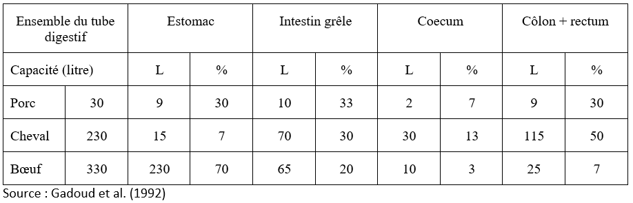
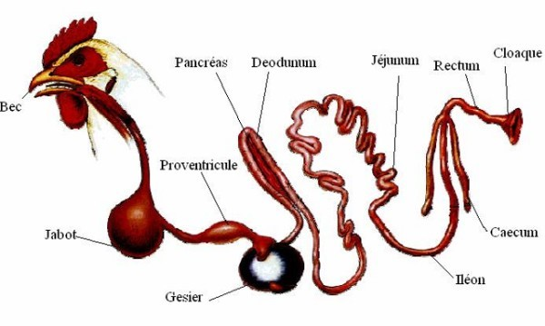
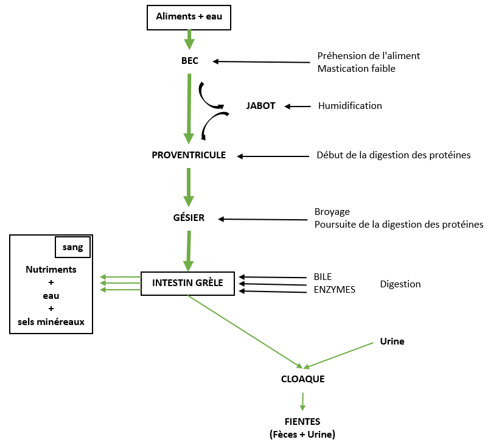

# Digestion des aliments {#digestion}

La grande partie des composés organiques des aliments est sous forme de grosses molécules qui doivent être fragmentées en éléments plus simples susceptibles de franchir les parois du tube digestif. 

La **digestion** est l’ensemble des phénomènes assurant, dans l'**appareil digestif**, la transformation des aliments en substances simples (ou nutriments) capables de passer dans le **sang** ou la **lymphe** et nécessaires à l'organisme animal (pour le métabolisme des cellules).

La digestion met en jeu :

- des **phénomènes physiques**, tels que la préhension, le broyage, l'humidification, le mélange et le transit des aliments (assuré par les contractions musculaires du tube digestif), et

- des **phénomènes chimiques** dus à des sécrétions digestives et à l'action de la population microbienne (bactéries et protozoaires) qui se développe dans le tube digestif (Gadoud et al., 1992, Larousse agricole, édition 2002, Cuvellier et al.).

Le porc est un omnivore monogastrique qui consomme des aliments d'origine animale et végétale. L'anatomie et la physiologie de son appareil digestif sont proches de celles de l'homme. Il est considéré ici comme animal de référence à partir duquel seront envisagées les particularités propres aux ruminants, au lapin et au poulet.

##	Anatomie et physiologie digestive chez les monogastriques

###	Chez le porc

L'appareil digestif du porc est constitué du tube digestif et des glandes annexes.

####	Description et rôles des parties du tube digestif

Le tube digestif comprend la cavité buccale, l’estomac, l’intestin grêle, le gros intestin, le coecum et le colon (Figure 3.1).

Figure 3.1 Schéma du tube digestif du porc.

Les dimensions (capacités) de chacun des composants sont comparées dans le tableau 3.1 pour le porc, le cheval et le bœuf.

Tableau 3.1 : Caractéristiques comparées du tube digestif du porc, du cheval et du bœuf

La cavité buccale du porc est délimitée par deux fortes mâchoires sur lesquelles est implantée une denture complète selon la formule pour l'adulte par demi-mâchoire : 3/3 i, 1/1 c, 4/4 pm, 3/3 m (_i, c, c, pm, m correspondent respectivement aux incisives, canines, prémolaires et molaires_). Les glandes salivaires sont très développées.

L'œsophage est un canal musculeux et très extensible animé de contractions péristaltiques réflexes, faisant suite à la déglutition. Les aliments parviennent très facilement et très rapidement à l’estomac par l’orifice du cardia qui ne comporte pas de sphincter.

L'estomac est une simple poche ovoïde dont la capacité d'environ 9 litres représente un peu moins du 1/3 de celle de l’ensemble du tube digestif. Quatre zones se différencient par leur muqueuse :

1. la	**zone œsophagienne**, sans glandes, peu étendue autour du cardia ;
1. la	**zone cardiale**, riche en glandes à mucus mais ne sécrétant aucun enzyme ;
1. la	**zone fundique** rassemblant des éléments sécrétoires libérant l'acide chlorhydrique et la pepsine ;
1. la	**zone pylorique** riche en glandes à mucus, entourant l'orifice de vidange de l'estomac, le pylore, pourvu d'un sphincter.

L’**intestin grêle** est bien développé chez le porc où il représente le 1/3 de la capacité totale du tube digestif. Il comprend d'abord le **duodénum** qui reçoit les sécrétions du foie et du pancréas, puis le **jéjunum** et l'**iléon**. La structure de l’intestin grêle est remarquable par la présence d'une muqueuse plissée formant des villosités qui en accroissent considérablement la surface. Muqueuse et sous-muqueuses renferment un grand nombre de glandes ayant un rôle important dans la digestion (Tableau 3.2).

Tableau 3.2 Origine et rôles des principales sécrétions digestives chez le porc

Le **gros intestin** est constitué d'un **cæcum** assez volumineux (2 litres) et du **côlon** (_côlon hélicoïdal et côlon flottant_). L'ensemble du gros intestin est caractérisé par l'absence de vilosités et la présence d'une activité microbienne importante.

####	Description et rôles des glandes annexes

Les glandes annexes sont à l’origine des sécrétions digestives. Ces glandes peuvent être bien individualisées (_glandes salivaires, foie, pancréas_) ou disséminées dans la paroi du tube digestif (_glandes gastriques, glandes intestinales_).

Les sécrétions digestives contiennent d'une part des enzymes digestives, d'autre part des substances non enzymatiques : acide chlorhydrique de l'estomac, bile du foie et mucus produit en différents lieux du tube digestif (estomac, intestin grêle, côlon).

####	La digestion dans la cavité buccale

Cette digestion est surtout mécanique, la mastication permettant de fragmenter les aliments et de les imbiber de salive. Un porc adulte produit environ 15 litres de salive par jour.

L'action de l'_amylase salivaire, la ptyaline_ est faible car le bol alimentaire est rapidement évacué vers l'estomac où le pH (faible) n'est pas favorable à l'action de cette enzyme.

####	La digestion dans l'estomac

Les aliments sont stockés pendant 7 heures en moyenne. Leur brassage avec le suc gastrique et leur évacuation progressive et fractionnée par l'ouverture périodique du pylore, constituent les rôles mécaniques de l'estomac.

Les glandes gastriques, situées dans la muqueuse, sécrètent le suc gastrique constitué de mucus, d'acide chlorhydrique et d'une enzyme protéolytique : la pepsine. 

La digestion chimique est due à l'action de la pepsine associée à l'acide chlorhydrique qui maintient un pH bas (2 à 4) optimal pour l'activité de cette enzyme. **La protéolyse est amorcée, les produits obtenus étant constitués pour l'essentiel de polypeptides solubles dans l'eau. La digestion des protéines par la pepsine aboutit donc à leur solubilisation**.

L'acide chlorhydrique sert également à désinfecter le contenu de l'estomac en détruisant les microbes apportés par les aliments et la salive.

Le mucus produit dans l'estomac joue le rôle de lubrifiant et de protecteur de la muqueuse contre la pepsine et l'acide chlorhydrique. **Il peut arriver que la protection de la muqueuse soit prise en défaut, l'irritation puis l'érosion de la muqueuse conduit à l'apparition d'ulcères plus ou moins graves**.

####	La digestion dans l'intestin grêle

La motricité intestinale, obéissant à des phénomènes réflexes, assure le malaxage du chyme intestinal, sa progression et son contact avec l'ensemble de la muqueuse. 

L'intestin grêle sécrète un suc relativement complexe contenant du mucus et de nombreuses enzymes : enzymes glycolytiques (maltase, lactase, saccharase, isomaltase), enzymes protéolytiques (peptidases) et une lipase. 

L'intestin grêle reçoit également les sécrétions digestives du foie et du pancréas :

-	la __bile__ provenant du foie, stockée dans une vésicule biliaire, est déversée par le canal cholédoque juste en aval du pylore. Basique, elle a deux actions digestives : 
1. la neutralisation du contenu acide provenant de l'estomac, et
1. l'émulsification des lipides par l'action tensio-active des sels biliaires ; l'émulsification est nécessaire à l'action de la lipase pancréatique ;

-	les sécrétions digestives du __pancréas__ exocrine déversées dans le duodénum par le canal de Wirsung (à 15 cm en aval du pylore). Elles contiennent des enzymes protéolytiques : peptidases, trypsine et chymotrypsine, une amylase et une lipase.

**C'est dans l'intestin grêle que s'effectue l'essentiel de la digestion chimique sous l'action conjuguée de la bile et des enzymes du pancréas et de l'intestin**. Ces enzymes constituent un équipement complet agissant sur l'ensemble des substrats alimentaires. L'intestin grêle est aussi le lieu préférentiel de l'absorption.

####	Statut des principaux substrats organiques à cette étape du transit

> Les glucides

L’**amidon** est hydrolysé en _dextrines_ et _diholosides_ sous l’action d’une _amylase pancréatique_ semblable à l'_amylase salivaire_.

Ces produits (_dextrines et diholosides_) sont à leur tour hydrolysés en _oses_ grâce à l'action des enzymes glycolytiques intestinales.

> Les lipides

L'action simultanée de la bile et des lipases pancréatique et intestinale sur les lipides donne des _monoglycérides_ et des _acides gras_ (AG) au cours d'une lipolyse incomplète.

> Les protides

Les enzymes protéolytiques du pancréas (_trypsine et chymotrypsine_) attaquent les grosses molécules de protéines en donnant un mélange composé d'une petite quantité d'_acides aminés_ libres et d'une grande quantité de petits peptides (_2 à 6 acides aminés_). **Les peptidases d'origine intestinale complètent l'hydrolyse des peptides en acides aminés libres**.

####	La digestion dans le gros intestin

Il n’existe pas de sécrétions enzymatiques dans le gros intestin mais il est riche en **glandes à mucus**. **L'absorption de l'eau et des minéraux en solution et la putréfaction des matières azotées résiduelles se déroulent dans le gros intestin**. A l'entrée dans le côlon, la digestion chimique est pratiquement terminée et la plupart des nutriments ont été absorbés dans l’intestin grêle.

La motricité du gros intestin assure la progression du contenu intestinal. Les résidus de la digestion (_les fèces_), sont constitués pour l'essentiel d'eau, de la fraction non absorbée des aliments et de cellules épithéliales desquamées.

Il existe dans le gros intestin du porc, notamment dans le cæcum, une population microbienne de bactéries et de protozoaires, active sur les glucides pariétaux des aliments d'origine végétale et sur l'amidon résiduel. La fermentation des glucides complexes (cet amidon) dans le gros intestin conduit principalement à la formation d'_acides gras volatils_ (AGV) - acides acétique, butyrique et propionique - qui, absorbés presque complètement par la muqueuse du cæcum et du côlon, peuvent apporter au porc 5 à 12 % de l'énergie digestible.

Les bactéries assurent également la synthèse de vitamines B qui peuvent être absorbées mais ne suffisent pas à la couverture des besoins.

Le Tableau 3.2 (ci-haut) permet de constater que les diverses sécrétions digestives apportent un équipement enzymatique complet, apte à dégrader la majorité des substrats protéiques, glucidiques et lipidiques. 

Les sites de déversement et les activités enzymatiques sont tels que la dégradation des divers substrats s'effectue de façon séquentielle au cours du transit des aliments qui dure de 4 à 6 jours.

####	Résumé de la digestion chez le porc

Chez le porc, la digestion allie :

-	des phénomènes mécaniques dans la cavité buccale, mais aussi dans l'ensemble du tube digestif ;

-	des phénomènes enzymatiques qui sont les plus importants et se déroulent pour l'essentiel dans l'intestin grêle grâce à un complexe enzymatique provenant du pancréas et de la muqueuse intestinale. La bile joue un rôle important dans la digestion des lipides ;

-	des phénomènes fermentaires microbiens dans le gros intestin. Leur importance est relativement faible, ils fournissent des vitamines B ne suffisant pas à couvrir les besoins, et des acides gras volatils représentant 5 à 12% de l'énergie digestible.

**Aucune absorption notable d'acides aminés microbiens n'est connue, si bien que le porc est tributaire de la qualité des protéines alimentaires**.

Le nutriment énergétique essentiel est le glucose, les nutriments azotés sont les acides aminés alimentaires.

###	Particularités de la digestion chez le lapin

Chez un lapin adulte, le tube digestif a une longueur totale d'environ 5 mètres. L’estomac est une poche relativement volumineuse formant un réservoir et contenant environ 100 à 150 g d'aliments plus ou moins pâteux. L'intestin grêle est long d'environ 3 m pour un diamètre de 0,8 à 1 cm. Son contenu relatif est assez faible. Il débouche à la base du cæcum dont la capacité est voisine de celle de l'estomac. Ces deux réservoirs (estomac et caecum) contiennent à eux seuls 80% du contenu digestif sec total.

Le cæcum est un lieu de passage et de séjour obligés pour les aliments et héberge une microflore très dense constituée essentiellement de bactéries cellulolytiques.

La principale originalité de la digestion chez le lapin réside dans le fonctionnement du côlon proximal qui permet de distinguer la digestion de la bouche au cæcum, de celle après le cæcum.

####	De la bouche au cæcum

Les particules alimentaires arrivent rapidement dans l'**estomac** après **mastication** et **insalivation**. Elles y séjournent 3 à 6 heures et y subissent peu de transformations sous l'action protéolytique de la pepsine.

Les éléments facilement dégradables sont digérés et absorbés dans l'**intestin grêle** au cours d'un séjour d'environ 1 h 30, sous l'action des enzymes intestinales et pancréatiques et de la bile. Les particules non dégradées entrent dans le cæcum où elles séjournent obligatoirement 2 à 12 heures pour subir l'attaque des bactéries.

Dans le **cæcum**, les glucides, résidus de l'activité de l'intestin grêle, donnent des acides gras volatiles qui sont absorbés. Les bactéries utilisent les résidus azotés pour leur multiplication, produisant des protéines microbiennes riches en acides aminés indispensables. Il y a production de vitamines B, C et K.

Évacué vers le côlon, le contenu du cæcum est constitué à 50 % environ de particules alimentaires non dégradées et de l’autre moitié de corps bactériens.

Jusqu'à ce stade, le fonctionnement de l'appareil digestif du lapin n'est pas réellement différent de celui des autres monogastriques. L'originalité réside dans le fonctionnement du côlon proximal.

####	Après le cæcum (lapin alimenté à volonté)

À la sortie du cæcum et à l'entrée du côlon, il y a possibilité de tri des particules selon leur taille. De plus, le côlon est capable de deux types d'activités différentes selon le moment de la journée :

-	Si le contenu du cæcum s'engage dans le côlon au début de la matinée, il y subit peu de transformations. La paroi sécrète un mucus qui enrobe progressivement les boules de contenu que les contractions de la paroi ont permis de former. Ces boules, protégées par le mucus, se trouvent réunies en grappes de cinq à dix. Éliminées en général aux environs de midi, ce sont les crottes molles ou cœcotrophes que le lapin ingère en les prélevant directement de l'anus. En référence au terme cœcotrophe (_aliment du cæcum_), la coprophagie intermittente et sélective du lapin est appellée __cœcotrophie__.

-	Si le contenu cœcal s'engage dans le côlon à un autre moment de la journée, son sort est différent et il est fractionné :

1. la fraction liquide, contenant les produits solubles, des corps microbiens et les petites particules (taille < 0,1 mm) est en grande partie refoulée vers le cæcum,

1. la fraction renfermant surtout les grosses particules (taille > 0,3 mm) est acheminée préférentiellement vers le côlon et le rectum, où elle forme les crottes dures riches en glucides pariétaux. Elles sont fabriquées la nuit, entre 18 h et 7 h et non ingérées.

Il règne à ce moment une activité intense dans le côlon : la paroi sécrète des enzymes capables de dégrader une partie importante des corps microbiens et peut absorber certains produits de cette bactériolyse, vitamines et acides aminés notamment. L'absorption d'eau est importante. La figure 3.2 résume ces principales étapes de la digestion chez le lapin.

Figure 3.2 : [Principales étapes de la digestion chez le lapin](https://www.cuniculture.info/Docs/Biologie/fig-biol/fig17g.gif)

####	Influence de la cœcotrophie sur le transit digestif

Une fois ingérés, les cœcotrophes sont retrouvés en grand nombre dans l'estomac, où ils peuvent représenter jusqu'aux ¾ du contenu. À partir de ce moment, ils suivent un transit digestif semblable à celui d'un aliment.

Compte tenu des fractions recyclées 1, 2 voire 3 ou 4 fois dans le cæcum et selon la nature des aliments, le transit digestif est d'environ 17 à 18 heures. Ce temps est plus court pour les grosses particules (14-16 heures) que pour les petites (20-24 heures), par suite du phénomène de tri des particules à la sortie du cæcum.

En allongeant le temps de séjour des particules fines dans le cæcum, la cœcotrophie, liée au tri des particules, contribue à prolonger de 30% environ le transit digestif et améliore donc l'utilisation digestive des aliments.

Elle est peu efficace pour améliorer la digestibilité des glucides pariétaux, puisque le recyclage des particules grossières est limité et que, contrairement aux ruminants, le transit digestif est d'autant plus rapide que les aliments sont plus riches en constituants pariétaux. Ainsi, la digestibilité de la cellulose brute n'est que de 20 à 40%.

Lorsque les particules alimentaires sont trop fines et/ou trop digestibles, le reflux vers le cæcum fonctionne au maximum et le transit digestif est très ralenti. L’équilibre de la microflore cœcale se modifie, ce qui peut entraîner des troubles digestifs graves : diarrhées, entérotoxémies. 

Le bon fonctionnement du tube digestif suppose donc un apport minimal et régulier de parois jouant le rôle de lest indispensable au maintien de la motricité intestinale et à l'équilibre de la microflore cœcale. Classiquement, le lest alimentaire est appréhendé par la teneur en cellulose brute (CB) de l'aliment puisque celle-ci est normalement digérée avec une faible efficacité. Cependant, certaines sources de cellulose brute sont hautement digestibles (pulpes de fruits, …), c'est pourquoi les recommandations sont proposées en cellulose brute indigestible.

####	Composition des crottes et intérêt nutritionnel de la cœcotrophie

Du fait de la spécificité des actions digestives aboutissant à leur formation, la composition des crottes molles est différente de celle des crottes dures : les cœcotrophes sont plus riches en eau et en matières azotées totales, plus pauvres en cellulose brute que les crottes dures (Tableau 3.3).

Tableau 3.3 Composition analytique des deux types de crottes du lapin (Gadoud et al., 1992)

| | Coecotrophes | Crottes dures |
| :----- | :-----: | :-----: |
| MS (%) | 30 | 60 |
| MAT (% MS) | 32 | 11 |
| Matières grasses (% MS) | 2 | 3 |
| Cellulose brute (% MS) | 28 | 51 |
| Matières minérales (% MS) | 8 | 5 |
| ENA (% MS) | 30 | 30 |

L'ingestion des cœcotrophes permet un recyclage des corps microbiens (environ 50% des cœcotrophes) et constitue un apport complémentaire de protéines riches en acides aminés indispensables, de vitamines B, C et K et de minéraux. En effet, la muqueuse de l'estomac sécrète des enzymes bactériolytiques provoquant la destruction des enveloppes bactériennes libérant ainsi leur contenu qui est digéré de la même façon que les aliments.

On estime que l'ingestion des cœcotrophes apporte au lapin adulte par jour :

-	5 à 7 g de protéines couvrant 20% de ses besoins, 
-	une quantité d'énergie correspondant à 10% du métabolisme basal 
-	et 45 g d'eau.

Cependant, dans les conditions d'élevage intensif d'animaux à besoins importants et bien alimentés, l'intérêt nutritionnel de la cœcotrophie reste limité.

####	Régulation de la cœcotrophie

La cœcotrophie n'existe pas chez le lapereau nouveau-né. Elle se développe vers la troisième semaine avec la consommation des aliments solides.

La cœcotrophie est directement conditionnée par le rythme alimentaire : l'ingestion des cœcotrophes est observée dans un délai de 8 à 12 heures après le pic d'ingestion. Chez un lapin alimenté à volonté, l'activité alimentaire est essentiellement nocturne ; de ce fait, la production des cœcotrophes se situe dans la matinée, l'émission des crottes dures est nocturne. À l'inverse, un lapin rationné consomme les aliments au moment de leur distribution, en général de jour. La production et l'ingestion des cœcotrophes se fait donc la nuit.

La régulation de la cœcotrophie est également sous le contrôle des glandes surrénales. Elle est inhibée par la sécrétion d'adrénaline. __Il est donc important d'offrir au lapin des conditions d'élevage calmes__.

###	Particularités de la digestion chez le poulet

Il existe chez les oiseaux des différences notables dans l'appareil digestif selon l'espèce. Mais seul le cas du poulet est résumé dans ce document.

####	L'appareil digestif du poulet

La cavité buccale ne comprend ni lèvres ni dents, mais seulement un bec corné, qui permet la préhension et une certaine fragmentation des aliments.

Les glandes salivaires, peu développées, sécrètent de la ptyaline. Il n'y a ni voile du palais ni épiglotte, si bien que la déglutition est un phénomène uniquement mécanique par redressement de la tête.

L'œsophage contient un renflement dont l'épithélium est riche en glandes à mucus : le jabot (Figure 3.2). Cet organe peut stocker des aliments, les humecter et les ramollir. Il fonctionne chez le poulet alimenté à volonté.

Figure 3.3 [L’appareil digestif du poulet](http://img.xooimage.com/files24/e/c/d/digestifqp8-17ea67b.jpg)

L'estomac comprend deux parties :

-	un estomac « chimique » qu’est le ventricule succenturié, dont la muqueuse est riche en glandes sécrétant à la fois l'acide chlorhydrique et le pepsinogène précurseur de la pepsine ;
-	un estomac « mécanique », le gésier, peu  sécréteur, caractérisé par une couche superficielle très dure entourée de muscles puissants. Le pH à l’intérieur est très bas (2 à 3,5) et il peut contenir de petits graviers nécessaires aux animaux consommant des grains entiers.

L'intestin grêle est un tube d'environ 1,2 m de longueur dont la paroi est bien équipée en glandes sécrétrices. Il reçoit à son début les sécrétions du pancréas et du foie.

Le gros intestin est peu développé et se réduit pratiquement à deux cæcums où ont lieu des fermentations bactériennes. Après un court rectum, on trouve le cloaque, carrefour des voies génitales, urinaires et intestinales.

La longueur totale du tube digestif est d'environ 2 mètres chez le poulet adulte.

####	La digestion chez le poulet

Les enzymes digestives des volailles sont similaires à celles des mammifères sauf la lactase qui est absente. Le transit des aliments est relativement rapide, il dure en moyenne 24 heures (Figure 3.4).

Figure 3.4 : Principales étapes de la digestion chez le poulet (Gadoud et al., 1992).

``{r, fig21-composition, fig.height = 10, fig.width = 5, out.width = "100%", fig.align = "center", warning = FALSE, message = FALSE, fig.cap = "Composition des aliments selon Brocard et al (2010).", echo = FALSE}
``

#### suite

