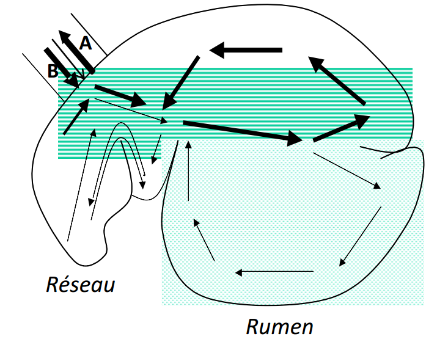
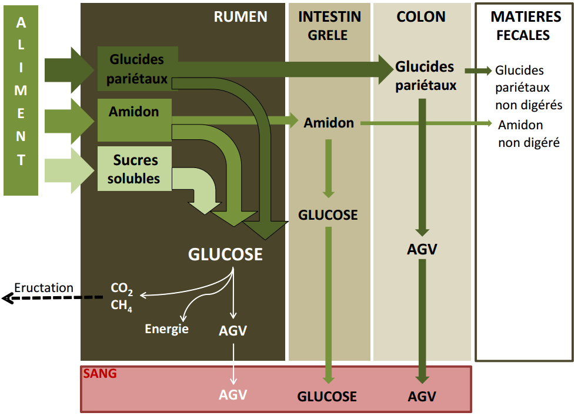

# Digestion des aliments {#digestion}

La grande partie des composés organiques des aliments est sous forme de grosses molécules qui doivent être fragmentées en éléments plus simples susceptibles de franchir les parois du tube digestif. 

La **digestion** est l’ensemble des phénomènes assurant, dans l'**appareil digestif**, la transformation des aliments en substances simples (_ou nutriments_) capables de passer dans le **sang** ou la **lymphe** et nécessaires à l'organisme animal (_pour le métabolisme des cellules_).

La digestion met en jeu :

- des **phénomènes physiques**, tels que la préhension, le broyage, l'humidification, le mélange et le transit des aliments (*assurés par les contractions musculaires du tube digestif*), et

- des **phénomènes chimiques** dus à des **sécrétions digestives** et à l'action de la **population microbienne** (_bactéries et protozoaires_) qui se développe dans le tube digestif (**Gadoud et al., 1992, Larousse agricole, édition 2002, Cuvellier et al, ...**).

Le **porc** est un **omnivore** monogastrique qui consomme des aliments d'origine animale et végétale. L'anatomie et la physiologie de son appareil digestif sont proches de celles de l'homme. Il est considéré ici comme animal de référence à partir duquel seront envisagées les particularités propres au **ruminant**, au **lapin** et au **poulet**.

##	Anatomie et physiologie digestive chez les monogastriques

###	Le porc

L'appareil digestif du porc est constitué du tube digestif et des glandes annexes.

####	Description et rôles des parties du tube digestif

Le tube digestif comprend la **cavité buccale**, l’**estomac**, l’**intestin grêle**, le **gros intestin**, le **coecum** et le **colon** (**Figure 3.1**).

**Figure 3.1** Schéma du tube digestif du porc.

Les dimensions (_capacités_) de chacun des composants sont comparées dans le **Tableau 3.1** pour le porc, le cheval et le bœuf.

**Tableau 3.1** Caractéristiques comparées du tube digestif du porc, du cheval et du bœuf.

La **cavité buccale** du porc est délimitée par 2 fortes mâchoires sur lesquelles est implantée une denture complète selon la formule pour adulte par demi-mâchoire : 3/3 i, 1/1 c, 4/4 pm, 3/3 m (_i, c, pm, m correspondent respectivement aux incisives, canines, prémolaires et molaires_). Les **glandes salivaires** sont très développées.

L'**œsophage** est un canal musculeux très extensible animé de contractions péristaltiques réflexes faisant suite à la **déglutition**. Les aliments parviennent très facilement et très rapidement à l’estomac par l’orifice du **cardia** qui ne comporte pas de **sphincter**.

L'**estomac** est une simple poche ovoïde dont la capacité d'environ 9 litres représente un peu moins du tiers $(1/3)$ de celle de l’ensemble du tube digestif. Quatre zones se différencient par leur muqueuse :

1. la	**zone œsophagienne**, sans glandes, peu étendue autour du cardia ;

1. la	**zone cardiale**, riche en glandes à mucus mais ne sécrétant aucun enzyme ;

1. la	**zone fundique** rassemblant des éléments sécrétoires libérant l'acide chlorhydrique et la pepsine ;

1. la	**zone pylorique** riche en glandes à mucus, entourant l'orifice de vidange de l'estomac, le **pylore**, pourvu d'un **sphincter**.

L’**intestin grêle** est bien développé chez le porc où il représente le tiers $(1/3)$ de la capacité totale du tube digestif. Il comprend :

- le **duodénum** qui reçoit les sécrétions du **foie** et du **pancréas**, 

- le **jéjunum**,

- et l'**iléon**. 

La structure de **l’intestin grêle** est remarquable par la présence d'une **muqueuse plissée** formant des villosités qui en accroissent considérablement la surface. Muqueuse et sous-muqueuses renferment un grand nombre de glandes ayant un rôle important dans la digestion (**Tableau 3.2**).

**Tableau 3.2** Origine et rôles des principales sécrétions digestives chez le porc.

Le **gros intestin** est constitué d'un **cæcum** assez volumineux (_2 litres_) et du **côlon** (_côlon hélicoïdal et côlon flottant_). L'ensemble du gros intestin est caractérisé par l'absence de vilosités et la présence d'une activité microbienne importante.

####	Description et rôles des glandes annexes

Les **glandes annexes** sont à l’origine des sécrétions digestives. Ces glandes peuvent être bien individualisées (_glandes salivaires, foie, pancréas_) ou disséminées dans la paroi du tube digestif (_glandes gastriques, glandes intestinales_).

Les sécrétions digestives contiennent d'une part des **enzymes digestives** et d'autre part des **substances non enzymatiques** : acide chlorhydrique de l'estomac, bile du foie et mucus produit en différents lieux du tube digestif (_estomac, intestin grêle, côlon_).

####	La digestion dans la cavité buccale

Cette digestion est surtout **mécanique**, la mastication permettant de fragmenter les aliments et de les imbiber de salive. Un porc adulte produit environ 15 litres de salive par jour.

L'action de l'**amylase salivaire** ou **ptyaline** est faible car le bol alimentaire est rapidement évacué vers l'estomac où le pH (_faible_) n'est pas favorable à l'action de cette enzyme.

####	La digestion dans l'estomac

Les aliments sont stockés pendant **7 heures** en moyenne. Leur brassage avec le **suc gastrique** et leur évacuation progressive et fractionnée par l'ouverture périodique du pylore, constituent les **rôles mécaniques de l'estomac**.

Les glandes gastriques, situées dans la muqueuse, sécrètent le suc gastrique constitué de mucus, d'acide chlorhydrique et d'un enzyme protéolytique : **la pepsine**. 

La digestion chimique est due à l'action de la pepsine associée à l'acide chlorhydrique qui maintient un pH bas (_2 à 4_) optimal pour l'activité de cette enzyme. **La protéolyse est amorcée, les produits obtenus étant constitués pour l'essentiel de polypeptides solubles dans l'eau**. 

**La digestion des protéines par la pepsine aboutit donc à leur solubilisation**.

L'**acide chlorhydrique** sert également à désinfecter le contenu de l'estomac en détruisant les microbes apportés par les aliments et la salive.

Le mucus produit dans l'estomac joue le rôle de lubrifiant et de protecteur de la muqueuse contre la pepsine et l'acide chlorhydrique. 

**Il peut arriver que la protection de la muqueuse soit prise en défaut, l'irritation puis l'érosion de la muqueuse conduit à l'apparition d'ulcères plus ou moins graves**.

####	La digestion dans l'intestin grêle

La motricité intestinale, obéissant à des phénomènes réflexes, assure le malaxage du **chyme intestinal**, sa progression et son contact avec l'ensemble de la muqueuse. 

L'intestin grêle sécrète un suc relativement complexe contenant du mucus et de nombreuses enzymes : enzymes glycolytiques (*maltase, lactase, saccharase, isomaltase*), enzymes protéolytiques (*peptidases*) et une lipase. 

L'intestin grêle reçoit également les sécrétions digestives du foie et du pancréas :

-	la __bile__ provenant du foie, stockée dans une vésicule biliaire, est déversée par le canal cholédoque juste en aval du pylore. Basique, elle a deux actions digestives : 

1. la neutralisation du contenu acide provenant de l'estomac, et
1. l'émulsification des lipides par l'action tensio-active des sels biliaires. L'émulsification est nécessaire à l'action de la lipase pancréatique ;

-	les __sécrétions digestives du pancréas__ exocrine déversées dans le duodénum par le canal de Wirsung (*à 15 cm en aval du pylore*). Elles contiennent des enzymes protéolytiques : peptidases, trypsine et chymotrypsine, une amylase et une lipase.

**C'est dans l'intestin grêle que s'effectue l'essentiel de la digestion chimique sous l'action conjuguée de la bile et des enzymes du pancréas et de l'intestin**. Ces enzymes constituent un équipement complet agissant sur l'ensemble des substrats alimentaires. L'intestin grêle est aussi le lieu préférentiel de **l'absorption**.

####	Statut des principaux substrats organiques à cette étape du transit

> Les glucides

L’**amidon** est hydrolysé en **dextrines** et **diholosides** sous l’action d’une **amylase pancréatique** semblable à l'**amylase salivaire**.

Ces produits (*dextrines et diholosides*) sont à leur tour hydrolysés en _oses_ grâce à l'action des enzymes glycolytiques intestinales.

> Les lipides

L'action simultanée de la bile et des lipases pancréatique et intestinale sur les lipides donne des _monoglycérides_ et des _acides gras_ (*AG*) au cours d'une lipolyse incomplète.

> Les protides

Les **enzymes protéolytiques** du pancréas (*trypsine et chymotrypsine*) attaquent les grosses molécules de protéines en donnant un mélange composé d'une petite quantité d'_acides aminés_ libres et d'une grande quantité de petits peptides (_2 à 6 acides aminés_). **Les peptidases d'origine intestinale complètent l'hydrolyse des peptides en acides aminés libres**.

####	La digestion dans le gros intestin

Il n’existe pas de sécrétions enzymatiques dans le gros intestin mais il est riche en **glandes à mucus**. **L'absorption de l'eau et des minéraux en solution et la putréfaction des matières azotées résiduelles se déroulent dans le gros intestin**. A l'entrée dans le côlon, la digestion chimique est pratiquement terminée et la plupart des nutriments ont été absorbés dans l’intestin grêle.

La motricité du gros intestin assure la progression du contenu intestinal. Les résidus de la digestion (**les fèces**), sont constitués pour l'essentiel d'eau, de la fraction non absorbée des aliments et de cellules épithéliales desquamées.

Il existe dans le gros intestin du porc, notamment dans le **cæcum**, une population microbienne de **bactéries** et de **protozoaires**, active sur les glucides pariétaux des aliments d'origine végétale et sur l'amidon résiduel. La fermentation des glucides complexes (*cet amidon*) dans le gros intestin conduit principalement à la formation d'_acides gras volatils_ (*AGV*) - acides **acétique**, **butyrique** et **propionique** - qui, absorbés presque complètement par la muqueuse du cæcum et du côlon, peuvent apporter au porc 5 à 12% de l'énergie digestible.

Les bactéries assurent également la synthèse de **vitamines B** qui peuvent être absorbées mais ne suffisent pas à la couverture des besoins.

Le **Tableau 3.2** (*ci-haut*) permet de constater que les diverses sécrétions digestives apportent un équipement enzymatique complet, apte à dégrader la majorité des substrats protéiques, glucidiques et lipidiques. 

Les sites de déversement et les activités enzymatiques sont tels que la dégradation des divers substrats s'effectue de façon séquentielle au cours du **transit des aliments qui dure de 4 à 6 jours**.

####	Résumé de la digestion chez le porc

Chez le porc, la digestion allie :

-	des **phénomènes mécaniques** dans la cavité buccale, mais aussi dans l'ensemble du tube digestif ;

-	des **phénomènes enzymatiques** qui sont les plus importants et se déroulent pour l'essentiel dans l'intestin grêle grâce à un complexe enzymatique provenant du pancréas et de la muqueuse intestinale. La bile joue un rôle important dans la digestion des lipides ;

-	des **phénomènes fermentaires microbiens** dans le gros intestin. Leur importance est relativement faible, ils fournissent des vitamines B ne suffisant pas à couvrir les besoins, et des acides gras volatils représentant **5** à **12%** de l'**énergie digestible**.

**Aucune absorption notable d'acides aminés microbiens n'est connue, si bien que le porc est tributaire de la qualité des protéines alimentaires**.

Le nutriment énergétique essentiel est le glucose, les nutriments azotés sont les acides aminés alimentaires.

###	Particularités de la digestion chez le lapin

Chez un lapin adulte, le tube digestif a une longueur totale d'environ $5~m$. L’estomac est une poche relativement volumineuse formant un réservoir et contenant environ $100~à~150~g$ d'aliments plus ou moins pâteux. L'intestin grêle est long d'environ $3~m$ pour un diamètre de $0,8~à~1~cm$. Son contenu relatif est assez faible. Il débouche à la base du cæcum dont la capacité est voisine de celle de l'estomac. Ces deux réservoirs (*estomac et caecum*) contiennent à eux seuls 80% du contenu digestif sec total.

Le cæcum est un lieu de passage et de séjour obligés pour les aliments et héberge une microflore très dense constituée essentiellement de **bactéries cellulolytiques**.

La principale originalité de la digestion chez le lapin réside dans le fonctionnement du côlon proximal qui permet de distinguer la digestion de la bouche au cæcum, de celle après le cæcum.

####	De la bouche au cæcum

Les particules alimentaires arrivent rapidement dans l'**estomac** après **mastication** et **insalivation**. Elles y séjournent 3 à 6 heures et y subissent peu de transformations sous l'action protéolytique de la pepsine.

Les éléments facilement dégradables sont digérés et absorbés dans l'**intestin grêle** au cours d'un séjour d'environ 1 h 30, sous l'action des enzymes intestinales et pancréatiques et de la bile. Les particules non dégradées entrent dans le cæcum où elles séjournent obligatoirement 2 à 12 heures pour subir l'attaque des bactéries.

Dans le **cæcum**, les glucides, résidus de l'activité de l'intestin grêle, donnent des acides gras volatiles qui sont absorbés. **Les bactéries utilisent les résidus azotés pour leur multiplication, produisant des protéines microbiennes riches en acides aminés indispensables**. Il y a production de **vitamines B**, **C** et **K**.

Évacué vers le côlon, le contenu du cæcum est constitué à 50% environ de particules alimentaires non dégradées et de l’autre moitié de corps bactériens.

Jusqu'à ce stade, le fonctionnement de l'appareil digestif du lapin n'est pas réellement différent de celui des autres monogastriques. L'originalité réside dans le fonctionnement du **côlon proximal**.

####	Après le cæcum (lapin alimenté à volonté)

À la sortie du cæcum et à l'entrée du côlon, il y a possibilité de tri des particules selon leur taille. De plus, le côlon est capable de deux types d'activités différentes selon le moment de la journée :

-	Si le contenu du cæcum s'engage dans le côlon au début de la matinée, il y subit peu de transformations. La paroi sécrète un mucus qui enrobe progressivement les boules de contenu que les contractions de la paroi ont permis de former. Ces boules, protégées par le mucus, se trouvent réunies en grappes de cinq à dix. Éliminées en général aux environs de midi, **ce sont les crottes molles ou cœcotrophes que le lapin ingère en les prélevant directement de l'anus**. En référence au terme cœcotrophe (_aliment du cæcum_), la **coprophagie** intermittente et sélective du lapin est appellée __cœcotrophie__.

-	Si le contenu cœcal s'engage dans le côlon à un autre moment de la journée, son sort est différent et il est fractionné :

1. la fraction liquide, contenant les produits solubles, des corps microbiens et les petites particules (taille < 0,1 mm) est en grande partie refoulée vers le cæcum,

1. la fraction renfermant surtout les grosses particules (*taille > 0,3 mm*) est acheminée préférentiellement vers le côlon et le rectum où elle forme les crottes dures riches en glucides pariétaux. Elles sont fabriquées la nuit entre 18 h et 7 h et ne sont pas ingérées.

Il règne à ce moment une activité intense dans le côlon : la paroi sécrète des enzymes capables de dégrader une partie importante des corps microbiens et peut absorber certains produits de cette bactériolyse, vitamines et acides aminés notamment. L'absorption d'eau est importante. La **figure 3.2** résume ces principales étapes de la digestion chez le lapin.

[**Figure 3.2**](https://www.cuniculture.info/Docs/Biologie/fig-biol/fig17g.gif) Principales étapes de la digestion chez le lapin.

####	Influence de la cœcotrophie sur le transit digestif

Une fois ingérés, les cœcotrophes sont retrouvés en grand nombre dans l'estomac où ils peuvent représenter jusqu'aux ¾ du contenu (75%). À partir de ce moment, ils suivent un transit digestif semblable à celui d'un aliment.

Compte tenu des fractions recyclées 1, 2 voire 3 ou 4 fois dans le cæcum et selon la nature des aliments, le transit digestif est d'environ 17 à 18 heures. Ce temps est plus court pour les grosses particules (*14 - 16 heures*) que pour les petites (*20 - 24 heures*), par suite du phénomène de tri des particules à la sortie du cæcum.

En allongeant le temps de séjour des particules fines dans le cæcum, la cœcotrophie liée au tri des particules, contribue à prolonger de 30% environ le transit digestif et améliore donc l'utilisation digestive des aliments.

La cœcotrophie est peu efficace pour améliorer la digestibilité des glucides pariétaux, puisque le recyclage des particules grossières est limité et que, contrairement aux ruminants, le transit digestif est d'autant plus rapide que les aliments sont plus riches en constituants pariétaux. Ainsi, la digestibilité de la cellulose brute n'est que de 20 à 40%.

Lorsque les particules alimentaires sont trop fines et/ou trop digestibles,

- le reflux vers le cæcum fonctionne au maximum 

- le transit digestif est très ralenti

- l’équilibre de la microflore cœcale se modifie, 

ce qui peut entraîner des troubles digestifs graves : diarrhées, entérotoxémies. 

Le bon fonctionnement du tube digestif suppose donc un apport minimal et régulier de parois jouant le rôle de **lest** indispensable au maintien de la motricité intestinale et à l'équilibre de la microflore cœcale. 

Classiquement, le **lest alimentaire8* est appréhendé par la **teneur en cellulose brute** (*CB*) de l'aliment puisque celle-ci est normalement digérée avec une faible efficacité. Cependant, certaines sources de **CB** sont hautement digestibles (*pulpes de fruits, ...*), c'est pourquoi les recommandations sont proposées en **CB indigestible**.

####	Composition des crottes et intérêt nutritionnel de la cœcotrophie

Du fait de la spécificité des actions digestives aboutissant à leur formation, la composition des crottes molles est différente de celle des crottes dures. Les cœcotrophes sont :

- plus riches en **eau** et en **matières azotées totales** (**MAT**), 
- plus pauvres en **CB** (**Tableau 3.3**).

**Tableau 3.3** Composition analytique des deux types de crottes du lapin (Gadoud et al., 1992).

| | Coecotrophes | Crottes dures |
| :----- | :-----: | :-----: |
| MS (%) | 30 | 60 |
| MAT (% MS) | 32 | 11 |
| Matières grasses (% MS) | 2 | 3 |
| Cellulose brute (% MS) | 28 | 51 |
| Matières minérales (% MS) | 8 | 5 |
| ENA (% MS) | 30 | 30 |

L'ingestion des cœcotrophes permet un recyclage des corps microbiens (*environ 50% des cœcotrophes*) et constitue un apport complémentaire de protéines (*riches en acides aminés indispensables*), de vitamines B, C, K et de minéraux. En effet, **la muqueuse de l'estomac sécrète des enzymes bactériolytiques provoquant la destruction des enveloppes bactériennes libérant ainsi leur contenu qui est digéré de la même façon que les aliments**.

On estime que l'ingestion des cœcotrophes apporte au lapin adulte par jour :

-	5 à 7 g de protéines couvrant 20% de ses besoins, 

-	une quantité d'énergie correspondant à 10% du métabolisme basal, 

-	et 45 g d'eau.

Cependant, dans les conditions d'élevage intensif d'animaux à besoins importants et bien alimentés, l'intérêt nutritionnel de la cœcotrophie reste limité.

####	Régulation de la cœcotrophie

La cœcotrophie n'existe pas chez le lapereau nouveau-né. Elle se développe vers la troisième semaine avec la consommation des aliments solides.

La cœcotrophie est directement conditionnée par le rythme alimentaire : 

- l'ingestion des cœcotrophes est observée dans un délai de 8 à 12 heures après le pic d'ingestion. 

Chez un lapin alimenté à volonté, l'activité alimentaire est essentiellement nocturne. De ce fait, la production des cœcotrophes se situe dans la matinée. L'émission des crottes dures est nocturne. 

À l'inverse, un **lapin rationné** consomme les aliments au moment de leur distribution, en général de jour. **La production et l'ingestion des cœcotrophes se fait donc la nuit**.

La régulation de la cœcotrophie est également sous le contrôle des **glandes surrénales**. Elle est inhibée par la sécrétion d'adrénaline. __Il est donc important d'offrir au lapin des conditions d'élevage calmes__.

###	Particularités de la digestion chez le poulet

Chez les oiseaux, il existe des différences notables dans l'appareil digestif selon l'espèce. Mais seul le cas du poulet est résumé dans ce document.

####	L'appareil digestif du poulet

La cavité buccale ne comprend ni lèvres ni dents, mais seulement un bec corné, qui permet la préhension et une certaine fragmentation des aliments.

Les glandes salivaires, peu développées, sécrètent de la ptyaline. Il n'y a ni voile du palais ni épiglotte, si bien que la déglutition est un phénomène uniquement mécanique par redressement de la tête.

L'œsophage contient un renflement dont l'épithélium est riche en glandes à mucus : le **jabot** (**Figure 3.3**). Cet organe peut stocker des aliments, les humecter et les ramollir. Il fonctionne chez le poulet alimenté à volonté.

 L’appareil digestif du poulet.](figures/fig3.3.jpg) 

L'estomac comprend deux parties :

-	un estomac « chimique » qu’est le ventricule succenturié, dont la muqueuse est riche en glandes sécrétant à la fois l'acide chlorhydrique et le pepsinogène précurseur de la pepsine,

-	un estomac « mécanique », le gésier, peu  sécréteur, caractérisé par une couche superficielle très dure entourée de muscles puissants. Le pH à l’intérieur est très bas (*2 à 3,5*) et il peut contenir de petits graviers nécessaires aux animaux consommant des grains entiers.

L'intestin grêle est un tube d'environ 1,2 m de longueur dont la paroi est bien équipée en glandes sécrétrices. Il reçoit à son début les sécrétions du pancréas et du foie.

Le gros intestin est peu développé et se réduit pratiquement à deux cæcums où ont lieu des fermentations bactériennes. Après un court rectum, on trouve le cloaque, carrefour des voies génitales, urinaires et intestinales.

La longueur totale du tube digestif est d'environ 2 mètres chez le poulet adulte.

####	La digestion chez le poulet

Les enzymes digestives des volailles sont similaires à celles des mammifères sauf la lactase qui est absente. Le transit des aliments est relativement rapide, il dure en moyenne 24 heures (**Figure 3.4**).

Dans **la bouche**, 

>> les aliments sont peu fragmentés et grossièrement insalivés. L'action de la 	ptyaline sur l’amidon y débute et se poursuit dans le jabot.

Le **jabot**

>> assure le stockage et le ramollissement des aliments grâce au mucus qui y est sécrété.	Il participe au transit alimentaire en jouant le rôle de pompe qui aspire et refoule.

Le **ventricule succenturié ou proventricule**

>> sécrète en abondance l'acide chlorhydrique mais le pH qui y règne n'est pas très bas (*3 à 4,5*), si bien que la transformation du pepsinogène en pepsine n'est pas complète et la protéolyse ne fait qu'y débuter.

Le **gésier**

>> c'est dans le gésier avec son pH bas (*2 à 3,5*), que se produit véritablement la protéolyse sous l'action de la pepsine. De plus, la présence de petits cailloux dans cette poche permet	à l'oiseau de broyer les graines. Si l'alimentation est à base de grains intacts, il importe de mettre des petits cailloux à disposition des animaux. Si les volailles sont nourries	avec des farines, l'activité mécanique du gésier est très réduite.

L'**intestin grêle** 

>> est le lieu préférentiel de la digestion chimique sous l'action des enzymes	intestinales, pancréatiques et de la bile.

Le **cæcum** 

>> est le siège de **fermentations bactériennes**, sans doute d'importance secondaire, qui permettent une utilisation partielle des **glucides pariétaux** des enveloppes des	grains. Il s'y produit aussi une synthèse de **vitamines B** qui pourraient profiter à	l'oiseau. Comme chez les autres espèces, il y a, à ce niveau, une absorption  importante	d'eau et de sels minéraux.

##	Anatomie et physiologie digestive chez les ruminants

###	Anatomie du tube digestif chez le ruminant

Le tube digestif des bovins est composé de la **bouche**, de la **langue**, des **dents**, du **pharynx**, de l’**œsophage**, des **estomacs**, des **intestins**, du **rectum** et de l’**anus**. Les estomacs se composent du **réseau**, du **rumen**, du **feuillet** et de la **caillette** (**Figure 3.5**). Le rumen, le réseau et, à un moindre degré, le feuillet, hébergent une population microbienne importante. 

Cette configuration particulière permet au ruminant d’effectuer une **prédigestion microbienne** des aliments, avec une utilisation particulièrement poussée des fibres présentes dans la ration (**Gadoud et al., 1992 ; Cuvellier et al., 2012**).

 Schéma simplifié du tube digestif de bovin adulte.](figures/fig3.5.png)

####	La bouche et l’œsophage

Les bovins n’ont **ni canine**, **ni incisive** à la mâchoire supérieure. Ils possèdent cependant à la place un « **bourrelet gingival** ». La langue, longue et très mobile, est un muscle recouvert d'une muqueuse sèche qui permet la préhension de l'herbe au pâturage. L'herbe est pincée entre les incisives inférieures et le bourrelet gingival et ensuite arrachée.

Des **glandes salivaires volumineuses** aident à imprégner le **bolus**. La salive, **contenant des bicarbonates et des phosphates**, possède un rôle tampon, d’imbibition des aliments et de lubrification. La production de salive peut atteindre 150 litres par jour chez une vache laitière. Elle dépend de la mastication elle-même liée à la fibrosité de la ration. On distingue la **mastication liée à l’ingestion (30 à 95 mouvements par minute)** et la **mastication mérycique**, liée à la rumination (*55 mouvements par minute*) (Gadoud et al., 1992 ; Cuvellier et al., 2012).

####	L’estomac, ou les estomacs

L’estomac est volumineux au point d’occuper les 4/5 de la cavité abdominale. Il comprent trois compartiments appelés **préestomacs** : le **réseau** (*réticulum*), le **rumen**, et le **feuillet** (*omasum*). Ceux-ci précèdent un $4^{ème}$ compartiment, la **caillette** (*abomasum*), qui correspond à l’estomac proprement dit. 

> **Réseau et rumen**

Le **réseau et le rumen**, visibles sur la **Figure 3.6**, sont souvent considérés ensemble car leur contenu se mélange fréquemment.

Le **rumen (*ou la panse*)** a une capacité d’environ 150 litres et représente 80% du volume total des estomacs. Sa paroi (*muqueuse*) interne, non sécretrice, est constituée de papilles (**Figure 3.7**) qui augmentent la surface de contact avec la masse alimentaire et qui permettent l’absorption de certains nutriments.

 Schéma du tube digestif du bovin adulte présentant les structures internes des estomacs.](figures/fig3.7.png)

Le **rumen** est situé sur le côté gauche de l’animal et s’étend du diaphragme au bassin. Une musculeuse importante comportant des piliers charnus divise le rumen en deux sacs. Il communique de façon large avec le réseau.

Le **réseau** (*reticulum ou encore bonnet*) est un petit réservoir situé entre le rumen et le diaphragme (**Figure 3.6**). Sa muqueuse, non sécrétrice, présente des alvéoles. Sa paroi présente une apparence réticulaire en **nids d’abeilles** tout à fait caractéristique (**Figure 3.7**). Sur la paroi droite et dorsale du réseau, cette structure fait place à un sillon relativement large et profond, appelé **gouttière œsophagienne**, qui s’étend du cardia jusqu’à l’orifice de communication entre le réseau et le feuillet appelé **orifice réticulo-omasal**. La gouttière œsophagienne ne se ferme que chez le veau recevant une alimentation lactée ou chez l'adulte lorsqu'il a très soif. L’orifice reticulo-omasal, étroit et contractile, joue un rôle capital dans le tri des particules sortant du rumen-réseau. 

Le rumen-réseau assure l’essentiel de la prédigestion des aliments avant qu’ils n’atteingnent la caillette. La masse alimentaire y subit en effet :

-	un brassage permanent via la motricité du rumen-réseau,
-	les fermentations microbiennes, et enfin,
-	un broyage poussé via la rumination.

La **rumination** (*mastication mérycique ou encore le mérycisme*) consiste en la régurgitation du bol alimentaire vers la bouche (*flèche A*) et sa re-mastication et re-imprégnation de salive (**Figure 3.8**). Elle permet une réduction de la taille des particules et une bonne imprégnation du bol alimentaire avec la salive, ce qui a pour effet d’augmenter la densité des particules. Elle permet, en d’autres mots, la vidange du rumen-réseau par la réduction en petites particules des végétaux les plus résistants à la mastication.

**Figure 3.8** Mouvements du bol alimentaire dans le rumen-réseau (Cuvellier et al., 2012).

Le réseau peut être considéré comme un véritable carrefour qui régule la circulation des particules alimentaires entre l’œsophage, le rumen et le feuillet. Ainsi, les particules suffisamment petites, de l’ordre de quelques millimètres, passent à travers l’orifice réticulo- omasal pour atteindre le feuillet, tandis que les particules de grande taille sont refoulées vers le réseau et le rumen, ce qui a pour effet de stimuler la rumination et la production de salive. Notons que l’**orifice réticulo-omasal** se trouvant en position basse, seules les particules ayant acquis une densité suffisante pour couler, et non plus flotter dans le rumen, passent à travers celui-ci.

> **Le feuillet**

Le **feuillet** (*ou omasum*) est le $3^{ème}$ préestomac des ruminants. Il fait suite au réseau avec lequel il communique par l’**orifice reticulo-omasal**, et précède la caillette avec laquelle il communique par un orifice beaucoup plus large et plus dilatable. Il  présente une muqueuse non sécrétrice et a une capacité d’environ 10 litres. Il doit son nom à la structure de ses parois constituées de fines lamelles (**Figure 3.7**). 

Le feuillet constitue une zone de transition entre :

-	le rumen-réseau où la digestion est initiée par des fermentations, et
-	la **caillette**, où la digestion est essentiellement enzymatique.

> **La caillette**

La caillette est le véritable estomac des ruminants. Le bolus alimentaire n’y séjourne
que 2 ou 3 heures. La caillette correspond à l'estomac des monogastriques, sa muqueuse est donc sécrétrice.

La caillette est surtout le lieu où débute la digestion des protéines, qu’il s’agisse :

-	des protéines apportées directement par la ration et qui ont échappé à la dégradation microbienne,

-	des protéines produites par les microorganismes du rumen, ou encore,

-	de ces derniers eux-mêmes, qui sont lysés et digérés à leur tour par le suc gastrique.

> **L’intestin**

L'intestin est divisé en deux parties :

-	l'**intestin grêle**, très long (*40 m chez le bovin adulte*), dont la structure et les rôles sont les mêmes que chez le porc. Il est composé de trois parties : le **duodénum**, le **jéjunum** et l’**iléum**. Le duodénum est pourvu de glandes dites duodénales, qui sécrètent diverses enzymes. Il reçoit en outre les sécrétions du foie (*la bile*) et du pancréas (*le suc pancréatique*). L’ensemble de ces sécrétions permettent de poursuivre et de compléter la digestion déjà entamée au niveau de la caillette par le suc gastrique.

Les glucides, les protéines et les lipides sont ainsi scindés en petites molécules qui vont être absorbées dans le **jéjunum** et l’**iléum**.

-	le **gros intestin** qui comprend le **cæcum**, le **côlon** et le **rectum**, ne sécrète pas de sucs digestifs et les mouvements y sont faibles. Par contre, des fermentations similaires à celles du **rumen** s’y produisent, en moindre proportion toutefois, contribuant à la digestion des fibres jusque-là non digérées. Une importante absorption d’eau a lieu dans le gros intestin, de même qu’une absorption de certains nutriments. Les résidus non digérés passent ensuite dans le **rectum** où se forment les matières fécales, évacuées par l’anus.

_Le trajet du bol alimentaire dans le tractus digestif dure 24 à 48 heures_.

####	Les glandes annexes

Les glandes annexes sont les mêmes que celles du porc, elles présentent cependant quelques particularités :

-	les glandes salivaires sont très développées, sécrétent 100 à 200 litres de salive par jour chez un bovin adulte (environ 10 litres/j chez un ovin). Elles jouent un rôle essentiel dans l'humidification du bol alimentaire. La sécrétion est continue, mais augmente fortement pendant la mastication.
-	la salive ne contient pas de ptyaline (amylase salivaire). Elle constitue une véritable solution tampon de pH basique (≈ 8,2).
-	la bile n'a pas un rôle important chez les ruminants qui ingèrent peu de lipides.

###	Le fonctionnement du rumen

Le rumen est un écosystème anaérobie strict, peuplé par 3 catégories de  microorganismes qui vivent en symbiose avec le ruminant : des bactéries, des protozoaires et des champignons. Ces microorganismes dégradent, via des processus d’hydrolyse et de fermentations, la plupart des composants de la ration alimentaire du ruminant, dans le but de couvrir leurs besoins et d’assurer ainsi leur survie. Simultanément, ils synthétisent différentes molécules nécessaires à leur développement, telles que des AA et des protéines.

####	Les bactéries

Les bactéries sont très nombreuses dans le rumen : de l’ordre de 10 milliards par ml de jus de rumen. Plus de 200 espèces bactériennes sont présentes. Ces bactéries sécrètent des enzymes qui assurent :

-	l’hydrolyse des protéines (ou la protéolyse) - enzymes protéolytiques ;
-	l’hydrolyse des glucides : 

> cellulose (cellulolyse, enzymes cellulolytiques) ; 

> hémicelluloses (hémicellulolyse, enzymes hémicellulolytiques) ; 

> pectines (pectinolyse, enzymes pectinolytiques) et 

> amidon (amylolyse, enzymes amylolytiques).

-	l’hydrolyse des lipides (lipolyse, enzymes lipolytiques) et leur hydrogénation (fixation d’hydrogène).

Le rumen ne peut fonctionner en l’absence des bactéries.

####	Les protozoaires

Les protozoaires sont moins nombreux que les bactéries (de l’ordre de 1 million/ml de jus de rumen), mais plus grands. A la différence des bactéries qui sécrètent des enzymes hydrolytiques dans le rumen, les protozoaires ingèrent les particules alimentaires ainsi que les bactéries du rumen, et les dégradent. Ils participent spécifiquement au métabolisme des glucides. Ils s’attaquent ainsi à tous les constituants des parois (cellulaires), et sont donc en concurrence avec les bactéries, qu’ils peuvent aussi consommer.

####	Les champignons

Les champignons du rumen sont des champignons anaérobies cellulolytiques qui dégradent la cellulose et les hémicelluloses, et sont particulièrement abondants lors de rations riches en fourrages.

Chaque microorganisme (bactéries, protozoaires, champignons) se caractérise par la nature du substrat auquel il est capable de s’attaquer, et est donc spécialisé dans des fonctions métaboliques précises, qui peuvent être parfois assez limitées. Par conséquent, la nature de la ration influence significativement la nature de la population microbienne : un régime riche en fourrages favorisera le développement des bactéries cellulolytiques, alors qu’un régime riche en céréales favorisera celui des bactéries amylolytiques.

La diversité des microorganismes présents fait néanmoins en sorte que les différentes espèces se complètent mutuellement, se chevauchent et se substituent les unes aux autres ; les produits terminaux du métabolisme d’une espèce servant de substrat pour le métabolisme d’une autre espèce.

Etant donné que les composants de la ration sont dégradés par des espèces microbiennes bien spécifiques, un changement dans la ration doit toujours être fait graduellement. Une transition alimentaire est donc nécessaire. En cas de changement brutal de la ration, des perturbations sévères peuvent parfois survenir. On considère en général qu’un changement de la population microbienne du rumen prend au minimum trois semaines.

Bactéries, protozoaires et champignons sont adaptés à vivre dans un environnement caractérisé par un pH de 6,0 à 7,0, en l’absence d’oxygène, à une température de 39 à 40°C et en présence de métabolites issus des fermentations.

Les principaux produits terminaux des fermentations microbiennes sont le dioxyde de carbone (CO2), le méthane (CH4), l’ammoniac (NH3) et les AGV (acides gras volatiles). Ces fermentations s’accompagnent d’un dégagement important de chaleur.

###	La digestion chez les ruminants

####	La dégradation des glucides

Elle comporte deux phases, une phase d’hydrolyse et une phase de fermentation. Une fois arrivés dans le rumen, les glucides sont hydrolysés sous l’action des enzymes hydrolytiques microbiennes. Le glucose représente le principal produit terminal de ce processus de dégradation. Ce glucose va ensuite être converti par le jeu des fermentations microbiennes en un métabolite intermédiaire, l’acide pyruvique. Celui-ci subit une dégradation ultérieure, qui va aboutir à la formation :

-	d’un mélange d'acides gras volatils (AGV), essentiellement acide acétique (C2), acide propionique (C3), acide butyrique (C4). Absorbés à travers la paroi du rumen, ils constituent la principale source d'énergie pour le ruminant. Ils fournissent 60 à 80% de l’énergie totale dont il a besoin à l’entretien ;

-	de gaz (gaz carbonique CO2 et méthane CH4) principalement, qui sont rejetés par éructation. Le rejet du méthane représente une perte énergétique.

L’acide lactique est quant à lui un produit intermédiaire de cette chaîne de dégradation.

La nature de la ration alimentaire, le pH intra-ruminal et le niveau d’ingestion de l’animal peuvent influencer la production des AGV (_section pas développée_).

La vitesse et l’ampleur de la digestion des glucides dans le rumen varient selon la nature de ceux-ci et selon l’origine botanique. Les sucres solubles et l’amidon sont rapidement fermentés. Exemples : l’amidon de l’avoine, de l’orge et du blé : amidon à dégradation rapide ou amidon rapide. Le maïs, le sorgho et la pomme de terre ont un amidon lent. L’amidon de l’orge est dégradé dans le rumen à raison de 90 à 95 %, alors que celui du maïs est dégradé selon des proportions nettement moindres (50 à 90 %). Les glucides pariétaux (cellulose et hémicellulose) sont quant à eux dégradés lentement et partiellement (de l’ordre de 30 à 50 %) (**Figure 3.9**). 

La **lignine** n’est pas dégradée par le ruminant.

Une fraction de l’amidon non digéré dans le rumen subit une digestion enzymatique dans l’intestin grêle qui entraîne la formation de glucose, absorbé à travers la paroi. L’amidon non digéré dans l’intestin grêle est en partie dégradé par les microorganismes du gros intestin. Les glucides pariétaux qui ont échappé aux fermentations microbiennes peuvent quant à eux subir une seconde fermentation dans le colon. La **Figure 3.10** tirée de Cuvellier et al. (2012) schématise la digestion des glucides chez le ruminant.

####	La dégradation des matières azotées

Les matières azotées alimentaires (composées des protéines et de l’azote non protéique) subissent dans le rumen-réseau une dégradation plus ou moins intense et rapide dont l'ammoniac (NH3) est le produit terminal le plus important.

Cette dégradation microbienne est rapide et totale pour les constituants non protidiques (urée, amides, ...) et pour les constituants protidiques simples (acides aminés libres, peptides, polypeptides). Elle est d'importance variable pour les protéines selon leur nature. Les matières azotées échappant à la dégradation dans le rumen-réseau sont constituées uniquement de protéines.

En présence d'énergie (issue de la dégradation des glucides) et de chaînes carbonées, l'ammoniac peut ensuite être utilisé pour la synthèse des protéines des bactéries : c'est la phase de protéosynthèse microbienne. La quantité de matières azotées microbiennes formées dépend de deux facteurs limitants principaux : la quantité d'ammoniac et la quantité d'énergie présentes dans le rumen-réseau.

Pour que la totalité des matières azotées fermentescibles soit utilisée, il est nécessaire qu’il y ait suffisamment d’énergie. Dans le cas contraire, les matières azotées excédentaires seront éliminées sous forme de NH3 potentiellement toxique. Le NH3 en excédent est en effet absorbé par la paroi du rumen et transporté jusqu’au foie où il est transformé en urée (**Figure 3.11**). Cette urée est principalement excrétée par les reins et éliminée par les urines et le lait chez la vache laitière. Elle peut cependant également retourner au rumen à travers la salive.

**Que deviennent les protéines microbiennes ?** Une partie de la population microbienne (et donc de leurs protéines) est dégradée au sein du rumen. Une autre partie reste libre dans le liquide du rumen. Une dernière partie est accrochée aux particules alimentaires. Une partie des bactéries libres et fixées aux particules alimentaires quitte le rumen et passe dans la caillette, où elle subit alors la digestion enzymatique (**Figure 3.11**).

Une partie des protéines de la ration résiste à la dégradation ruminale et passe dans la caillette, où elle est alors dégradée par voie enzymatique (protéines by-pass).

La résistance des protéines alimentaires à l’action des microorganismes ruminaux dépend précisément de la nature de la protéine. Les protéines végétales crues (telles que celles présentes dans les fourrages) sont ainsi généralement très dégradables, celles ayant subi un traitement par la chaleur le sont moins. 

Au niveau de la caillette et de l’intestin grêle, toutes les protéines, qu’elles soient microbiennes ou d’origine alimentaire, subissent l’action des enzymes digestives et sont dégradées en AA.

####	La dégradation des lipides

Les lipides sont présents en faible quantité (2 à 6% de la MS) dans la plupart des aliments des ruminants comparés aux teneurs en glucides et en matières azotées. **Les lipides arrivant dans le rumen sont constitués à 50% environ de triglycérides, et de l’autre moitié, d’acides gras libres. Les lipides des fourrages, des grains et des graines sont caractérisés par leur richesse en acides gras longs ( > Cl8) insaturés**.

**Le rumen est le siège d’une lipolyse intense et rapide :**

-	les lipides de l’aliment sont hydrolysés par les microorganismes du rumen, ce qui permet la production de glycérol et d’acides gras libres ;

-	le glycérol formé est rapidement fermenté en AGV, alors que les acides gras insaturés sont fortement remaniés par les microorganismes du rumen (**NB : le degré de saturation des acides gras alimentaires n'est pas modifié par la digestion chez le porc**) ;

-	les acides gras libres, fixés aux particules alimentaires, quittent le rumen, passent dans la caillette, puis dans l’intestin grêle, où ils sont digérés et absorbés.

A côté de leur activité de dégradation des lipides alimentaires, les microorganismes
du rumen synthétisent des lipides microbiens, caractérisés notamment par la présence
d’acides gras ramifiés. Lorsque ces microorganismes quittent le rumen et passent dans la caillette, ils sont tués et désintégrés par le suc gastrique. Ceci permet la  libération des lipides microbiens, les acides gras libres microbiens rejoignant le  pool d’acides gras libres pour subir la digestion et l’absorption intestinales (**Figure 3.12**).

####	Bilan de la digestion chez le ruminant

Chez le ruminant, la digestion est caractérisée par :

-	les phénomènes de motricité du rumen-réseau, conduisant en particulier à la rumination ou mérycisme ;

-	la prédominance des phénomènes fermentaires dans le rumen-réseau par rapport aux phénomènes enzymatiques propres du ruminant dans la caillette et l'intestin grêle. 
La population microbienne du rumen-réseau dégrade ou remanie la majeure partie de tous les constituants organiques de la ration. Cela se traduit par l'utilisation plus ou moins poussée des glucides pariétaux et la fermentation des sucres simples et de l'amidon, une réorganisation des matières azotées et une synthèse de vitamines B.

Il sort du rumen-réseau :

-	la majeure partie des corps bactériens ;
-	une partie plus faible des protozoaires ;
-	35 à 40 % de la matière organique digestible de la ration, surtout constituée de protéines alimentaires et de glucides pariétaux ayant échappé à la dégradation microbienne (**Figure 3.13**).

Après le rumen-réseau, la digestion dans l'estomac fonctionnel (la caillette) et dans les intestins est pratiquement semblable à celle qui a lieu chez le porc. On peut cependant noter les particularités suivantes :

-	dans le feuillet dépourvu de sécrétions digestives a lieu une importante absorption d'eau et de sels minéraux, surtout le sodium et le potassium ;

-	la nature des substrats arrivant dans la caillette et l'intestin est particulière. _Les glucides ne sont pratiquement plus représentés que par des glucides pariétaux et éventuellement un peu d'amidon ; les matières azotées sont de deux types : alimentaires et microbiennes_. Ce qui confère aux ruminants une relative indépendance vis-à-vis des sources azotées de la ration ; il en est de même pour les vitamines B synthétisées par les microbes.

##	La digestion des minéraux

Les macro-éléments et les oligo-éléments se trouvent sous des formes chimiques variées dans les aliments. Leur absorption au niveau du tube digestif est conditionnée par :

-	la forme sous laquelle ils se trouvent : par exemple, l’absorption du calcium est limitée lorsqu’il est présent dans l’aliment sous forme d’oxalates de calcium ;

-	les interactions entre certains minéraux : par exemple, au niveau de l’intestin grêle, l’absorption du Ca est corrélée positivement à la concentration en phosphore minéral, mais négativement à celle en magnésium ;

-	le statut physiologique de l’animal en cet élément : par exemple, l’absorption intestinale du Ca est augmentée lorsque les concentrations en calcium dans le sang sont faibles, et ce, grâce à la sécrétion de vitamine D active.

##	Les voies de l’absorption

L'**absorption** est le passage de matériaux de la lumière intestinale vers le milieu intérieur via les cellules absorbantes. Certains produits de la digestion peuvent être utilisés par la paroi digestive (*glucose, certains acides aminés*) ou être remaniés par celle-ci (AGV), cependant la majorité d'entre eux traversent la paroi et peuvent ensuite emprunter deux voies :

-	*l'eau, les sels minéraux, les oses, les acides  aminés, les  acides  gras courts, les vitamines hydrosolubles* passent directement dans le sang et arrivent au foie via la veine porte hépatique ;

-	*les lipides, essentiellement des triglycérides  reconstitués dans la cellule absorbante à partir des acides gras à longue chaîne, et les vitamines liposolubles* gagnent les capillaires lymphatiques, leur donnant un  aspect laiteux caractéristique pendant la digestion, et rejoignent finalement le système sanguin.

Ainsi, toutes les substances absorbées se retrouvent en définitive dans le sang, soit directement, soit par la lymphe (**Figure 3.14**).

L'absorption des vitamines est liée à leur solubilité : 

- les vitamines hydrosolubles, notamment celles du groupe B, sont absorbées en même temps que la solution d'électrolytes ; 

- les vitamines liposolubles (A, D, E, K) sont absorbées en même temps que les lipides.

L'eau contenant les sels minéraux est absorbée surtout dans les intestins chez les non-ruminants, dans le feuillet et les intestins chez les ruminants.

**Les produits de l'absorption, ou les nutriments, sont déversés dans le sang ou la lymphe et rejoignent en définitive la circulation sanguine**. Le **Tableau 3.4** présente de façon simplifiée les résultats de l'absorption chez le porc, le cheval et les ruminants.

**Tableau 3.4** Résultats de l'absorption chez le porc et les ruminants.

## L’utilisation digestive des aliments

Les aliments ingérés ne sont pas absorbés en totalité, une partie des **ingesta** (**I**) traverse le tube digestif et se retrouve dans les **fèces** (**F**).

L'**utilisation digestive** des aliments est caractérisée par leur **digestibilité**.
La digestibilité apparente (**da**) est la proportion  $\frac{(I-F)}{I}$ d'aliment qui disparaît apparemment dans le tube digestif :

$$da=\frac{(I-F)}{I}=\frac{(qté~ingérée~-~qté~excrétée~dans~les~fèces)}{qté~ingérée}$$

Mais en fait, il existe dans les féces, des produits qui ne proviennent pas des ingesta. Ce sont des substances endogènes (sécrétions digestives, mucus, produits de desquamation de la paroi du tube digestif) ou d'origine microbienne, dont il est très difficile d'évaluer l'importance. Ces produits sont appelés « **fèces endogènes** (**Fe**) » (**Figure 3.15**).

On définit alors la **digestibilité réelle** (**dr**) comme la proportion d'aliment qui disparaît réellement dans le tube digestif; **dr** est donc plus élevée que **da** :

$$dr=\frac{(I-(F-Fe))}{I}=\frac{(qté~ingérée-(qté~excrétée~dans~les~féces-qté~endogène))}{qté~ingérée}$$

La digestibilité s'exprime par un rapport inférieur à **1**. Elle peut s'appliquer à différents composants de la ration ou de l'aliment : 

- matière sèche (**dMS**), 
- matière organique (**dMO**), 
- divers constituants organiques, 
- énergie (**dE**).

Lorsqu'on emploie le terme général de digestibilité d'un aliment, on désigne la digestibilité apparente de la matière organique de cet aliment (dMO).

Le **coefficient d'utilisation digestive** (**CUD**), ou **coefficient de digestibilité** est le produit de la digestibilité par 100, exprimé en % : CUDa(%) = da*100.

Par exemple, écrire qu'un aliment a une digestibilité de 0,80 équivaut à écrire qu'il a un CUD de 80 %, soit $\frac{80}{100}$ = 0,80.

La digestibilité constitue le principal facteur de variation de la valeur énergétique des aliments.

La digestibilité apparente varie selon la nature de l’aliment, sa composition chimique et la présence éventuelle de **facteurs antinutritionnels**. Sa détermination peut être effectuée par différentes méthodes :

- des méthodes sur l’animal (**in vivo** par récolte des matières fécales, ou par sachet de nylon incubé dans le rumen et l’intestin grêle),
- ou en laboratoire (**in vitro**).

La digestibilité des aliments d'origine animale est généralement élevée et moins variable que celle des aliments végétaux pour lesquels il faut distinguer, au plan de l'utilisation digestive, les constituants intracellulaires des constituants des parois (ou constituants pariétaux).

###	Digestibilité des constituants intracellulaires

Il s'agit des glucides cytoplasmiques hydrosolubles (sucres), des glucides cytoplasmiques de réserve (l’amidon), des lipides et des protides intracellulaires. Leur digestibilité est élevée chez toutes les espèces animales. Le contenu cellulaire renferme aussi l'essentiel des minéraux et des vitamines.

Pour les aliments concentrés, consommés à la fois par les herbivores et les non-herbivores, la digestibilité des constituants intracellulaires est de 70 à 100 %, elle est proche de 100 % chez tous les animaux pour les sucres et l'amidon.

Pour les fourrages consommés par les herbivores, ruminants et chevaux, la digestibilité de tous les constituants du contenu cellulaire est élevée. Elle est totale (100 %) pour les glucides hydrosolubles et le plus souvent pour l'amidon, et elle peut atteindre 95 % pour les matières azotées et les lipides des fourrages.

###	Digestibilité des constituants pariétaux

Ce sont les constituants des parois végétales composés des glucides pariétaux (*cellulose, hémicelluloses, pectines*) plus ou moins incrustés de lignine.

La digestibilité des constituants non lignifiés dépend largement de l'espèce utilisatrice pour toutes les catégories d'aliments végétaux, y compris les concentrés dont certains sont relativement riches en parois. **Ces parois sont pratiquement indigestibles chez les volailles, et ont une digestibilité de 10 à 30 % chez le lapin, de 30 à 50 % chez le porc, de 80 à 90 % chez les ruminants, plus faible de 5 à 10 points chez les chevaux**.

Les différences sont liées essentiellement à la présence de microorganismes, surtout les bactéries cellulolytiques du rumen et du gros intestin, et aussi à la durée du séjour des particules alimentaires dans ces réservoirs.

La lignine est indigestible dans toutes les espèces. De plus, elle rend la cellulose, et encore plus les hémicelluloses, inaccessibles ou résistantes aux bactéries cellulolytiques. **La lignine constitue donc une barrière à la digestion des parois chez toutes les espèces, y compris chez les herbivores**.

###	Conséquences sur la digestibilité de la matière organique

Les données sur la digestibilité des différents constituants cellulaires conduisent à une loi générale dans toutes les espèces : 

>> la digestibilité de la matière organique des aliments diminue quand la teneur en parois augmente. Plus précisément, la digestibilité de la matière organique dépend de celle des parois. Elle est fonction de l'espèce utilisatrice qui digère plus ou moins complètement les parois non lignifiées.

Ce principe général est illustré sur les **Figures 3.16 et 3.17** où la teneur en parois est estimée en fonction de la teneur en cellulose brute.

 Digestibilité de la matière organique (dMO) de différentes matières en fonction de la teneur en cellulose brute (CB).](figures/fig3.16.png)

C'est grâce à la présence d'une population microbienne dense dans les pré-estomacs des ruminants et dans le gros intestin des équidés que les parois non lignifiées, et donc la matière organique des fourrages peuvent être utilisées efficacement.

C'est alors la proportion de parois lignifiées qui limite la digestibilité des parois et donc celle de la matière organique. Prévoir la digestibilité des fourrages revient en définitive à prévoir leur teneur en parois indigestibles (ou indigestible pariétal).

La teneur en parois, et surtout en parois lignifiées, est plus élevée dans les fourrages que dans les aliments concentrés, c'est pourquoi la digestibilité des concentrés est supérieure à celle des fourrages. Ce classement des aliments selon leur digestibilité est le même chez les ruminants et les chevaux en fonction de la teneur en parois (**Tableau 3.5**).

**Tableau 3.5** Digestibilité de la MO de quelques aliments chez les ruminants et les chevaux.

La digestibilité des fourrages est très variable selon l'origine botanique, le stade végétatif et les conditions de récolte. L'absence de rumination et la plus faible durée de séjour des parois végétales dans le gros intestin du cheval (24 à 48 h) par rapport à celle observée dans le rumen (48 à 72 h) expliquent en grande partie que la digestion de ces parois, donc des fourrages, est moins poussée chez les chevaux que chez les ruminants. La richesse en grains, donc en amidon, de l'ensilage de maïs lui confère une dMO équivalente chez les ruminants et les chevaux.

**EN RESUMÉ**

La digestibilité apparente d'un aliment est la proportion de sa matière organique qui disparaît apparemment dans le tube digestif. La digestibilité constitue le principal facteur de variation de la valeur énergétique des aliments.

Chez tous les animaux, la digestibilité des aliments végétaux diminue lorsque leur teneur en parois cellulaires augmente. La nature de ces parois intervient également, notamment pour les herbivores leur degré d'incrustation par la lignine totalement indigestible.

La digestibilité d'un fourrage diminue au fur et à mesure que le rapport feuilles/tiges décroît et donc que la proportion de parois augmente. Pour un cycle de végétation, elle diminue quand la plante vieillit.

La diminution de la digestibilité due au fanage est surtout fonction des conditions climatiques pendant la fenaison et de la famille botanique. L'ensilage et la déshydratation correctement réalisés ne diminuent pratiquement pas la digestibilité.
À partir de mesures directes de la digestibilité et de méthodes permettant sa prévision, l'INRA a publié les Tables de la valeur nutritive des aliments pour les animaux monogastriques, les ruminants et les chevaux.

##	L’utilisation métabolique des nutriments

###	Métabolisme et catabolisme

Les cellules de l'organisme ont besoin d'énergie et de matériaux pour se renouveler, se multiplier ou produire. Elles disposent pour cela des nutriments résultant de l'absorption et des métabolites issus de la mobilisation des réserves corporelles.
Transportés aux cellules après leur absorption, les nutriments jouent différents rôles :
-	rôle énergétique ou dynamique. La seule source d'énergie des animaux est constituée par la matière organique qu'ils consomment ;

-	rôle plastique. Les nutriments servent au renouvellement ou à la constitution des tissus vivants, du lait, des œufs, ou des productions de la peau ;

-	rôle physiologique ou fonctionnel. Les nutriments participent à la synthèse de différentes substances indispensables au fonctionnement de l'organisme (enzymes, hormones, anticorps, acides nucléiques).

L'utilisation des nutriments et des métabolites se fait avec des transformations qui constituent le métabolisme. Ce dernier revêt deux aspects liés entre eux : l'**anabolisme** et le **catabolisme**.

- *L'anabolisme conduit à la synthèse de substances complexes par l'organisme (rôles plastique et physiologique des nutriments) et s'accompagne de dépenses énergétiques*.

- *Le catabolisme se traduit par la destruction de certaines molécules avec libération d'énergie. Cette libération d'énergie se fait surtout par oxydation (on parle de catabolisme oxydatif). Il s'agirait plutôt de déshydrogénation des substrats et d'une suite de transports d'hydrogène et d'électrons. Ces réactions peuvent se dérouler en anaérobiose. Le catabolisme laisse des déchets qui sont principalement le gaz carbonique (CO2), l'eau, l'urée et l'acide urique*.

Une partie de l'énergie provenant du catabolisme est dépensée sous forme de chaleur, une autre partie est stockée et peut être utilisée dans les réactions de synthèse correspondant à l'anabolisme. 

Ces deux types de réactions, anabolique et catabolique, sont donc étroitement liés. Par exemple, la synthèse d'un dipeptide à partir de deux acides aminés AA 

> réaction d'anabolisme protéique

est associée à une réaction de catabolisme énergétique 

> dégradation d'une molécule d'ATP avec libération de l'énergie nécessaire à la réaction précédente

tel que schématisé à la **Figure 3.18**.

###	Utilisation des nutriments pour les productions

Les nutriments provenant de l'absorption sont en partie utilisés par le tube digestif pour son propre fonctionnement. Le reste sert de matériau dans les synthèses de l'organisme et de substrat énergétique.

Alors que, chez les **monogastriques**, le glucose est le principal nutriment énergétique, les AGV sont la source d'énergie essentielle chez les ruminants. 

Quand les besoins énergétiques liés à l'anabolisme sont très élevés, certains acides aminés (AA) glucoformateurs et le glycérol, provenant de l'alimentation ou du catabolisme des réserves, servent à la néoglucogenèse.

La mamelle synthétise la majeure partie des constituants du lait : 100 % du lactose, 90 % des protéines, les acides gras courts et moyens (AGCM) des matières grasses. Le sang apporte les autres constituants issus des synthèses hépatiques à partir des nutriments et des métabolites résultant de l'utilisation des réserves (acides gras AG longs essentiellement).

Pour la **production de viande**, les protéines sont synthétisées dans le muscle et les os à partir de la réserve (pool) métabolique des acides aminés. Les **dépôts adipeux** nécessitent la fourniture aux adipocytes de glycérol et d'acides gras. Chez les monogastriques, ces matériaux proviennent en quasi-totalité du glucose. Chez les herbivores, notamment chez les ruminants, ils sont produits à partir des AGV.

Chez les **ruminants**, l'utilisation des AGV est fondamentale :

-	la production de viande est favorisée par une forte proportion de propionate (C3) dans le mélange d'AGV produit dans le rumen. Des rations riches en céréales orientent les fermentations ruminales vers la production d'un tel mélange ;

-	chez les femelles en lactation, l'accumulation de réserves corporelles n'est pas recherchée. En effet, si le mélange (d’AGV dans le rumen) est trop pauvre en acétate (C2), il peut en résulter une limitation des synthèses d'acides gras courts et moyens dans la mamelle. Aussi, un manque de propionate (C3) diminue la synthèse mammaire de lactose et donc la production laitière. La ration doit, de ce fait, permettre l'obtention d'un mélange d'AGV équilibré en C2 et C3 pour ne pénaliser ni la production ni la richesse du lait en matières grasses.

La production de la partie comestible d'un **œuf** consiste essentiellement en la synthèse de lipides et de protides :

-	les lipides, tous contenus dans le jaune d’œuf, sont synthétisés dans le foie à partir principalement de nutriments et de métabolites non lipidiques ;

-	les protides du jaune d’œuf sont élaborés dans le foie, ceux du blanc d’œuf, dans le magnum de l'oviducte. L'équilibre des acides aminés alimentaires influe plus que la teneur de la ration en MAT, sur la protéosynthèse, notamment au niveau du magnum.
