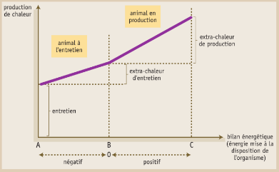
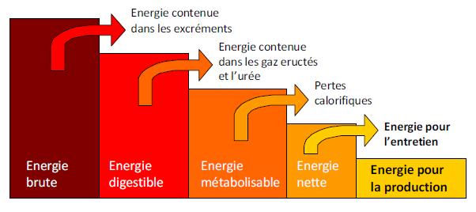
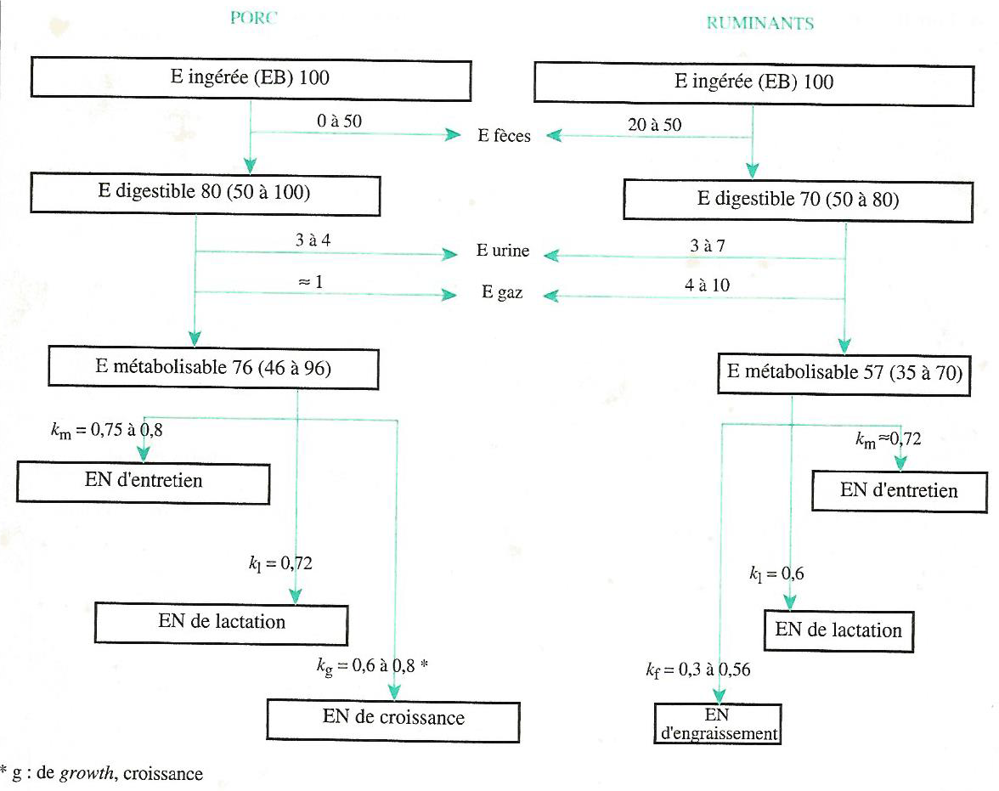
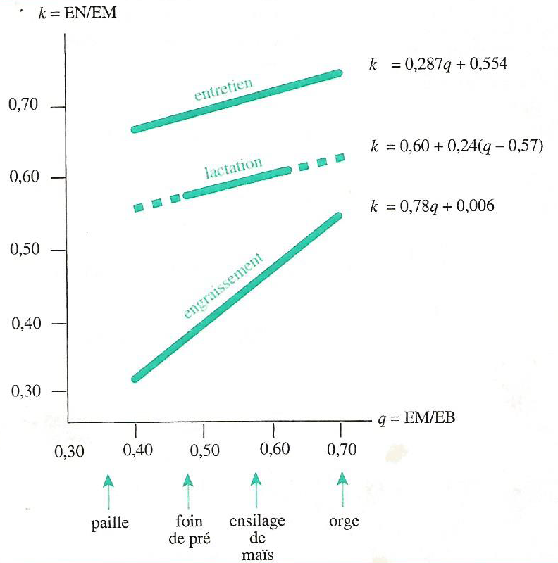
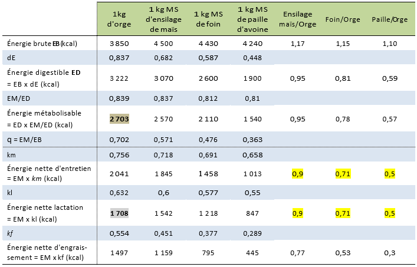
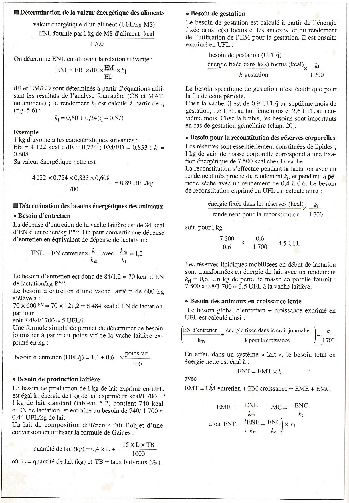
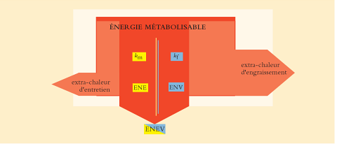
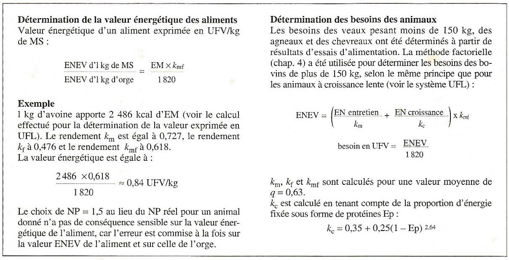

# Expression des besoins des animaux et des apports de la ration {#expression}

Les animaux se caractérisent par 5 catégories de besoins différents qui doivent être couverts par l’alimentation : 

- les besoins en **énergie**, 
- les besoins **matières azotées**, 
- les besoins en **minéraux**, 
- les besoins en **vitamines** et
- le besoin en **eau**. 

Les aliments doivent apporter à l'animal tous les constituants nécessaires au bon fonctionnement de l'organisme et à la réalisation des productions qui peuvent être :

- du travail, 
- de la croissance (croît), 
- de la viande, 
- un ou des fœtus, 
- du lait, 
- des œufs, etc.

L'ajustement des apports alimentaires peut être quotidien mais certaines rations peuvent aussi couvrir les besoins d’une période bien plus longue comme il est le cas avec les carnivores au zoo. Cette possibilité dépend à la fois de la nature de la dépense et des caractéristiques des animaux.

La détermination des besoins nutritionnels des animaux tient compte de critères tels que :

- l’espèce, 
- la génétique, 
- le stade physiologique, 

Il faut ensuite adapter ces besoins en fonction des performances obtenues.

##	Nature des dépenses

### Les	dépenses d'entretien

Les activités de l'organisme animal sont à l'origine d'une dépense en éléments nutritifs. **Les dépenses d'entretien correspondent à la possibilité pour l’animal de se maintenir en vie, sans variation de poids et sans production d'aucune nature**. Ce sont,

-	d'une part, les dépenses dues au fonctionnement de base de l'organisme, et
-	d'autre part, les dépenses supplémentaires liées aux conditions de vie (station debout, en déplacement, ...).

### Les	dépenses de production

**Les dépenses de production correspondent à la réalisation d’une production donnée par l’animal**, qui peut être : une croissance, un engraissement, une gestation, la lactation (production laitière), la ponte, un travail (traction bovine).

###	Application à la vache laitière productrice de lait

Le lait synthétisé dans la mamelle contient en moyenne par kg :

-	871 g d'eau ; 
-	129 g de matière sèche comprenant 48 g de lactose (glucide), 40 g de matières grasses (lipides), 
-	33,5 g de matières azotées, 
- 7,5 g de matières minérales, dont 1,25 g de calcium, 
-	0,95 g de phosphore, 
- et des vitamines et substances diverses à l'état de traces.

Pour cela, la vache a effectué des dépenses en matériaux et en énergie (*en d'autres termes, elle a utilisé des produits finaux de la digestion*), expliqué en ce qui suit :

####	Dépense en matériaux

Les constituants organiques du lait sont, dans leur quasi-totalité, synthétisés par la mamelle à partir d'éléments prélevés dans le sang : glucose, acétate, acides gras longs, acides aminés, etc. Pour être plus précis :

-	le lactose est synthétisé à partir du glucose prélevé dans le sanguin ;
-	les protéines du lait (*caséines, lactoglobulines, lactalbumines*) sont synthétisées à partir des acides aminés ;
-	les graisses du lait sont élaborées en partie à partir des AG longs véhiculés par le sang et inclus sans modification importante dans la matière grasse du lait, et en partie à partir de l'acétate et du β-hydroxybutyrate provenant directement ou indirectement des fermentations du rumen. Dans ce dernier cas, la mamelle réalise des synthèses qui conduisent à la production d'AG à chaînes plus courtes (8 à 14 atomes de carbone).

Les minéraux et les vitamines sont extraits du sang et inclus dans le lait sans transformation ni synthèse.

La production de lait occasionne ainsi une dépense en matériaux (*utilisation de nutriments*) tels que du glucose, des acides aminés, des acides gras, des minéraux, et des vitamines.

####	Dépense en énergie

Les différentes synthèses nécessaires pour l'élaboration du lait ont lieu dans les cellules sécrétrices des acini. Ces synthèses sont réalisées par des réactions biochimiques complexes. On peut citer, par exemple, la synthèse du lactose à partir d'une molécule de galactose et d'une molécule de glucose (**équation 4.1**) :

$$Galactose + Glucose ===> Lactose + Eau$$		

Le sang ne contenant pas de galactose, les cellules sécrétrices doivent donc au préalable assurer la synthèse du galactose à partir d'une molécule de glucose.

Ces synthèses sont, sous la dépendance d'hormones catalysées par des enzymes, elles ne peuvent avoir lieu sans énergie. En effet, toute activité cellulaire s'accompagne d'une consommation d'énergie provenant de la combustion d'un élément (ou constituant) organique (constituant de la matière organique). Ainsi, la réaction de synthèse précédente (équation 3.1) peut être réalisée par les cellules sécrétrices grâce à l'énergie libérée lors de la combustion d'une molécule de glucose. Globalement, cette réaction de combustion peut s'écrire (**équation 4.2**) :

$$C6H12O6 + 6 O2 ====> 6 CO2 + 6 H2O + énergie$$

En fait, au niveau cellulaire, la réaction de combustion (réaction d'oxydation) est fragmentée en étapes successives. Cela permet une lente libération de l'énergie. La fourniture de l'oxygène nécessaire à la réaction d'oxydation et l'élimination des produits de déchets (CO2 et H2O) sont assurés par la respiration.

L'énergie nécessaire peut provenir d'un élément (constituant) glucidique, lipidique ou protidique, qui peuvent en effet subir une oxydation au niveau cellulaire. Aux dépenses en matériaux s'ajoute donc une dépense en énergie.

Ainsi, les dépenses d'entretien entraînent :

-	une dépense en matériaux, liée au perpétuel renouvellement des tissus de l'organisme, dont la vitesse varie avec le tissu considéré et avec l'âge. Par exemple, le renouvellement des protéines musculaires se traduit par une perte d’azote sous forme d'urée chez les mammifères et d'acide urique chez les oiseaux, compensée par une synthèse protéique à partir des acides aminés sanguins,

-	une dépense énergétique liée au maintien des processus vitaux : respiration, circulation, sécrétions internes, tonus musculaire, pousse des poils, activité physique minimale (station debout, déplacements, ...), ingestion et digestion de la ration, énergie nécessaire aux synthèses assurant le renouvellement des tissus de l'organisme, etc.

##	Besoins et apports alimentaires

###	Expression des besoins

Alimenter rationnellement les animaux consiste à compenser les dépenses d'entretien et de production grâce à un apport par les aliments, sans carence ni excès. Il s'agit donc de fournir à l'animal un apport nutritif équilibré et en quantité suffisante.

Les éléments nutritifs contenus dans les aliments ne sont pas entièrement disponibles pour la couverture de ces dépenses. En effet, les aliments sont transformés en éléments utilisables en deux étapes principales (**Figure 4.1**) :

1. la digestion dont les produits finaux sont absorbés et déversés dans le sang et la lymphe sous forme de nutriments. Le coefficient d'utilisation digestive (CUD) aussi appelé la digestibilité caractérise l'efficacité de cette étape

1. le métabolisme qui, à partir des nutriments, permet de satisfaire les besoins avec un rendement appelé coefficient d'utilisation métabolique (CUM).

Il est donc théoriquement possible d'exprimer les besoins à l'un des 3 niveaux suivants :

1. celui de l'aliment (*composition brute*) ;
1. celui de l'absorption intestinale (*utilization digestive*) ;
1. celui de la dépense elle-même, c'est-à-dire le niveau cellulaire (*utilisation nette*).

Le niveau retenu est variable selon la nature de la dépense et l’espèce animale considérées. **Dans tous les cas, pour la cohérence du système retenu, la valeur nutritive des aliments doit évidemment être exprimée au même niveau que les besoins des animaux**.

####	Chez les ruminants

Le niveau retenu pour l'énergie est celui de la dépense elle-même. Les besoins énergétiques et la valeur énergétique des aliments sont donc exprimés en **énergie nette** (**EN**). Pour les matières azotées, le système des **PDI** (*protéines digestibles dans l'intestin*) retient le niveau de l'absorption intestinale.

####	Chez le porc et la volaille

C'est le niveau de l'absorption intestinale qui est choisi pour exprimer les valeurs des aliments et des besoins en **énergie digestible** (**ED**). Pour les matières azotées, les besoins et les valeurs des aliments sont exprimées en matières azotées totales (**MAT**) et en acides aminés (**AA**) au niveau de l'aliment.

Pour les minéraux, on retient dans tous les cas (ruminants et monogastriques), le niveau de l'aliment.

###	Méthodes d’estimation des dépenses et des apports alimentaires

Deux approches différentes peuvent être utilisées pour estimer les dépenses et les besoins :

1. la **méthode factorielle** qui consiste à déterminer le besoin total en sommant les différents besoins partiels correspondant aux différentes fonctions physiologiques. Elle est en principe la plus précise mais sa principale limite réside dans la difficulté de determiner certains besoins partiels, par exemple, le besoin pour la croissance est difficile à définir car on connaît souvent mal la composition du gain de poids.

1. la **méthode globale** qui repose sur l'évaluation globale du besoin total à partir d'essais d'alimentation. Elle n'est utilisée que lorsque la méthode factorielle est inutilisable ou trop imprecise.

Les besoins doivent être couverts par les apports alimentaires. **Théoriquement les apports alimentaires doivent être strictement égaux aux besoins**. En pratique, et en général, on ajuste quotidiennement les apports aux besoins en considérant une marge de sécurité suffisante (très variable selon la nature des besoins), ce qui conduit aux **apports alimentaires recommandés**. Ainsi donc, les apports alimentaires recommandés (ou recommandations alimentaires) sont supérieurs aux besoins. Les principales raisons justifiant l'adoption d'une marge de sécurité sont :

-	les incertitudes liées aux caractéristiques des aliments et des matières premières dues à la variabilité de leur composition et/ou à l'imprécision des méthodes d'analyse,

-	les incertitudes sur la valeur exacte des besoins : l'alimentation se raisonne de plus en plus au niveau d'un troupeau et l'hétérogénéité des individus, en particulier quant à leurs performances, nécessite de prendre des marges de sécurité suffisantes. Toute homogénéisation des performances, quelle qu'en soit la cause, conduit à diminuer les apports recommandés, pour une même performance moyenne,

-	les incertitudes sur la prévision des quantités consommées dont les causes multiples peuvent être liées à l'animal, à l'aliment, ou au milieu.

Dans certains cas particuliers, les apports alimentaires recommandés peuvent être inférieurs aux besoins car on admet une utilisation des réserves corporelles. Deux situations peuvent être rencontrées :

1. Animaux à besoins modérés pour lesquels, pour des raisons économiques, on a intérêt à minimiser le coût de l'alimentation à un moment donné. Cette diminution est obtenue par des apports alimentaires inférieurs aux besoins des animaux. Les réserves corporelles (lipidiques, azotées, minérales, vitaminiques) constituées pendant la période de pâturage, permettent de faire face au déficit de l'apport. En principe, la reconstitution est réalisée sans problème lorsque l'herbe est abondante et que la capacité d'ingestion des animaux est suffisamment importante. Cette opération est économiquement rentable dans la mesure où l'alimentation au pâturage est de faible coût.

1. Animaux à besoins élevés pour lesquels entrent en jeu des impératifs physiologiques. Une telle situation se rencontre notamment en début de lactation, dans le cas des vaches laitières fortes productrices. Dans ce cas, la sous-alimentation (énergétique et minérale) des animaux est imposée, non pas par calcul stratégique, mais par capacité d'ingestion des animaux insuffisante face à des dépenses importantes.

**En résumé**

Les activités de l'organisme animal sont à l'origine de dépenses ou besoins,

-	d'une part en énergie,
-	d'autre part en matériaux : glucose, acides aminés, éléments minéraux.

Ces dépenses couvrent l'entretien de l'animal, et éventuellement la réalisation de productions (croissance, engraissement, gestation, lactation, ponte, travail, etc).

L'objectif de l'alimentation rationnelle est de couvrir les besoins avec les apports alimentaires recommandés.

##	Besoins ou dépenses en énergie 

La transformation des aliments au cours de la digestion apporte de l'énergie aux cellules de l'organisme. L'animal se procure l'énergie nécessaire à la couverture de ses besoins en utilisant les nutriments issus de la digestion des aliments et de l'absorption, ou en se servant de ses réserves corporelles en cas d’un jeûne ou d’une sous-alimentation.

Les dépenses énergétiques des animaux correspondent à une production de matières (*fœtus, lait, tissus corporels, œuf, laine ou autre*) contenant de l'énergie chimique, et une production de chaleur provenant du fonctionnement de l'organisme.

On peut distinguer 3 types de dépenses énergétiques :

-	la **dépense énergétique d'entretien**, liée au maintien de la vie et au fonctionnement normal de l'organisme dans les conditions d'élevage, sans tenir  compte  des productions,

-	les **dépenses énergétiques de production**, correspondant à l'énergie contenue dans les produits (*fœtus, lait, tissus corporels, œuf, laine, ou autre*),

-	et **l’extra-chaleur** qui est la dépense énergétique consécutive à l'utilisation des aliments pour satisfaire les dépenses d'entretien et de production. L'extra-chaleur se manifeste par une production de chaleur.

On peut écrire (**équation 4.3**) :

$$Dépense~totale = Dépense~d'entretien + Dépense~de~production + Extrachaleur$$

L'unité officielle de mesure de l’énergie est le **joule** (**J**) ou le **kilojoule** (**kJ**), mais on utilise aussi la **calorie** (**cal**) ou la **kilocalorie** (**kcal**). Le joule et la calorie sont liées par (**équation 4.4**) :

$$1~cal = 4,185~J~et~1~kcal = 4,185~kJ$$

###	La dépense en énergie pour l’entretien

La dépense d'entretien comprend l'énergie dépensée par le métabolisme de base et l'énergie nécessaire au maintien du poids de l'animal dans les conditions de vie normale.

####	Le metabolisme de base (Métabolisme basal)

C'est la dépense énergétique d'un animal à jeun, au repos, non endormi, placé à une température correspondant à la **zone de neutralité thermique**. 

> La zone de neutralité thermique est la plage de température où l'organisme n'effectue pas de dépense pour lutter contre l'excès de chaleur ou contre le froid (**Tableau 4.1**).

**Tableau 4.1** Zone de neutralité thermique de différentes catégories d'animaux

|Catégorie d’animaux|Zone de neutralité thermique|
|:----|:----:|
|Bovins|5 à 20 °C|
|Chèvres|10 à 20 °C|
|Veaux|5 à 15 °C|
|Porcs de 40 à 80 kg|20 à 23 °C|
|Porcs de 80 à 110 kg|15 à l6 °C|
|Volailles|15 à 25 °C|
|Poussins d'un jour|≈ 32 °C|
|Poulettes de six semaines|≈ 21 °C|
|Poules pondeuses|15 à 20 °C|
|Lapins|15 à 18 °C|

Le métabolisme de base augmente moins vite que le poids vif des animaux. Il n'est pas proportionnel au poids, mais plutôt à la surface corporelle et plus précisément au poids vif (kg) élevé à la puissance 0,75 qu'on appelle le **poids métabolique** (**équation 4.5**).

$$Poids~métabolique = (Poids~vif)^{0,75}$$

On exprime donc les dépenses du métabolisme de base par rapport au poids métabolique et non par rapport au poids vif.

La dépense du métabolisme de base est de l'ordre de $70~kcal/kg~P^{0,75}$ pour l'homme et les espèces domestiques. Cette dépense varie avec :

-	l'espèce : $75~kcal/kg~P^{0,75}$ chez les bovins, $55~kcal/kg~P^{0,75}$ chez les ovins,

-	la race : elle est supérieure de 13 % chez les bovins laitiers comparés aux bovins à viande,

-	l'individu, 
-	la saison, 
-	la lumière 
-	et la température.

####	Dépense énergétique d'entretien

Dans les conditions habituelles d'élevage, un animal n'est jamais placé dans les conditions définies pour la mesure du métabolisme de base. Il réalise une activité physique et vit dans des condifions climatiques parfois éloignées de celles du confort thermique.

La dépense énergétique d'un animal à l'entretien correspond à la production de chaleur de l'animal non productif à jeun. Elle comprend l'énergie dépensée par le métabolisme de base et l'énergie nécessaire au maintien de l'animal dans les conditions de vie normales (**équation 4.6**).

$$Entretien = Métabolisme~de~base + Thermorégulation + Activité~physique$$

###	La dépense en énergie pour la production

Les produits réalisés peuvent être exportés (*lait, œufs, laine*), ou stockés au sein de la masse corporelle (*croissance*).

Les quantités de lipides (**Lip.**), de protéines (**Prot.**) et de glucides (**Glu.**) fixées ou exportées permettent de calculer la quantité d'énergie contenue dans le produit réalisé, c'est-à-dire la dépense énergétique de production (**DÉP**) par (**équation 4.7**) :

$$DÉP~(kcal) = 5,5 * Prot. (g) + 9,4 * Lip. (g) + 4,1 * Glu. (g)$$

####	Dépense en énergie pour la production de lait

La dépense en énergie pour la production de lait dépend de la quantité de lait produite et de sa composition chimique. Le **Tableau 4.2** présente les compositions moyennes d'un kg de lait de différentes espèces. La dépense occasionnée par la production de 1 kg de lait peut être calculée à partir de sa composition chimique.

**Tableau 4.2** Composition moyenne d'un kg de lait de différentes espèces

|| Matières grasses (g)|Protéines (g)|Lactose (g)|Énergie (kcal)*|
|:----|:----:|:----:|:----:|:----:|
|Lait standard de vache|40|31|48|740|
|Lait de chèvre|32|30|43|670|
|Lait de brebis|63|56|44|1080|
|Lait de truie (des 3 1ères semaines)|69|46|55|1140|
|Lait de lapine|120|160|20|2250|

(*Verifiez les valeurs de l’énergie avec l’équation de la dépense énergétique !!!*)

Lorsqu'il est difficile de connaitre la production laitière d'une femelle allaitante, on peut estimer la dépense en énergie pour la lactation à partir de la croissance de la portée. Le **Tableau 4.3** donne des estimations de la production de lait de la brebis allaitante au cours des trois premières semaines de lactation à partir de la croissance entre 10 et 30 jours de la portée.

**Tableau 4.3** Production laitière de la brebis (en litres) selon le GMQ 10-30j de sa portée.

(S’essayer à estimer le besoin en énergie pour la production d’une brébis de chaque catégorie !!!).

####	Dépense en énergie pour la croissance

Elle correspond à l'énergie des protéines et des lipides fixés. La croissance est due essentiellement à une accumulation de protéines et de lipides corporels. On néglige l'énergie fixée sous forme de glucides, car les réserves glucidiques corporelles sont faibles. 

La fixation énergétique s'effectue dans les muscles, les dépôts adipeux, les os, les viscères, la peau, le sang, etc. Elle dépend de la vitesse de croissance et de la composition chimique du croît.

La quantité d'énergie fixée est d'autant plus grande que le dépôt de gras est plus intense.

####	Dépense en énergie pour la gestation

La dépense en énergie pour la gestation correspond à la fixation d’énergie par le ou les fœtus, le placenta, les enveloppes, la paroi utérine et la glande mammaire. Elle devient importante au cours du dernier tiers $(1/3)$ de la gestation.

####	Dépense en énergie pour la production d'œufs

L'œuf entier de poule a la constitution moyenne suivante : 

- coquille 9 %, 
- albumen 61 %, 
- vitellus 30 %. 

La partie comestible d'un œuf de poule de $60~g$ est composée en moyenne de :

-	$40~g$ d'eau ;
-	$6,7~g$ de protéines ;
-	$6,5~g$ de lipides ;
-	$0,2~g$ de glucides 
-	et $0,5~g$ de minéraux. 
-	Il contient environ $100~kcal$, soit $1,6~kcal/g$ d'œuf.

####	Dépense en énergie pour la production de laine et de poils

Cette dépense est très faible. Elle est par exemple de :

- $17~kcal/j$ pour la production annuelle de $1~kg$ de laine mohair par une chèvre Angora, 
- ou $55~kcal/j$ pour la production annuelle d'une toison de $4~kg$ par un mouton Mérinos.

####	Dépense en énergie pour la reconstitution des réserves corporelles

Chez les femelles en lactation, les réserves corporelles mobilisées participent à la couverture de la dépense énergétique lorsque l'apport énergétique est inférieur à la dépense. La reconstitution des réserves est nécessaire pour aborder un nouveau cycle de production. L'accroissement de la masse corporelle est surtout réalisé par une accumulation de lipides. $1~kg$ de gain de masse corporelle correspond à une fixation énergétique de $7500~kcal$ chez la vache laitière.

La masse corporelle est estimée imparfaitement à partir du poids vif car la masse du contenu digestif est très variable. L'appréciation et la notation de l'état corporel des animaux permettent d'estimer le niveau des réserves corporelles, ainsi que leurs variations dans le temps.

####	Dépense en énergie pour le travail musculaire (l’effort musculaire)

Tout travail musculaire provoque une augmentation de la consommation d'oxygène par rapport à celle enregistrée chez l'animal au repos. L'élévation de la consommation d'O2 reflète l'intensité du travail fourni et permet de quantifier la dépense calorifique consécutive au travail.

La consommation du cheval de selle de $550~kg$, exprimée en litre d'O2/mn, s'accroît linéairement avec la vitesse de course, exprimée en m/mn. La relation est la suivante (**équation 4.8**) :

$$Quantité~d’O2~(en~litre/mn) = 3,78 + 0,097 * vitesse~(en~m/mn)$$

Ce même cheval au repos consomme $1,65~litres~d'O2/mn$. La dépense énergétique est calculée à partir de la consommation d'O2 pendant et après l'effort (*exemple ultérieurement !*). Après un effort, on enregistre une forte consommation appelée dette en O2, due au métabolisme du lactate produit par le muscle en état d'anaérobiose au moment de l'effort.

###	L’extra-chaleur

L’extra-chaleur ou la dépense d'extra-chaleur est consécutive à :

-	l'ingestion et la digestion des aliments, c'est-à-dire la prise des aliments, la mastication, le brassage, la progression du bol alimentaire dans le tube digestif, la chaleur des fermentations, l'activité glandulaire et métabolique des différentes parties du tube digestif. Il faut y ajouter la perte calorifique due à l'agitation des animaux avant la distribution des repas,

-	l'utilisation métabolique des nutriments absorbés. Par exemple, une mole de glucose fournit à la cellule $473~kcal$ dans des conditions aérobies alors que la combustion complète d'une mole de glucose fournit $673~kcal$. Toute l'énergie potentielle du glucose n'est pas utilisée par la cellule, il y a transformation incomplète de l'énergie avec un rendement de $473/673~(≈ 0,7)$. Le complément, c'est-à-dire les 30 % restant de l'énergie, est perdu sous forme de chaleur.

Un animal qui ne réalise aucune production, couramment appelé animal à l'entretien (*exemple : animal à poids constant, vache tarie non gestante à poids constant*), a cependant deux types de dépenses :

1. une dépense énergétique d'entretien telle qu'elle a été précédemment définie

1. et une dépense d'extra-chaleur, dite extra-chaleur d'entretien.

Lorsque cet animal réalise une production, aux dépenses précédentes s'ajoutent (**Figure 4.2**):

-	une dépense énergétique de production et 
-	une dépense d'extra-chaleur appelée extra-chaleur de production. 

On peut donc écrire (**équation 4.8**) :

$$Extrachaleur~totale = Extrachaleur~d'entretien + Extrachaleur~de~production$$

On définit également l’extra-chaleur comme correspondant à l’augmentation de production calorique due au fait qu’un animal passe de l’état de jeûne à l’état d’animal alimenté (**équation 4.9**) :

$$ECt = Calimenté~–~Cjeun$$
avec :

- $ECt = Extrachaleur~totale$,
- $Calimenté = production~de~haleur~de~l’animal~alimenté$,
- $Cjeun = production~de~chaleur~de~l’animal~à~jeun$.

La **Figure 4.3** fait apparaître les différentes origines de la chaleur produite : **entretien, extra-chaleur d’entretien et extra-chaleur de production**.

-	Le point **A** correspond à un animal à jeun et à poids constant, qui produit cependant de la chaleur en mobilisant des reserves corporelles pour couvrir ses dépenses d’entretien (cas théorique). 
-	Le point **B** correspond à un animal à l’entretien et alimenté, 
-	et le point **C**, à un animal en production et alimenté.

**En résumé**

Les dépenses énergétiques des animaux sont de 3 types :

1. la dépense d'entretien qui comprend l'énergie dépensée par le métabolisme de base et l'énergie nécessaire au maintien de l'animal dans des conditions de vie normale :

$$Entretien = métabolisme~de~base + thermorégulation + activité~physique$$

Le métabolisme de base est la dépense énergétique d'un animal à jeun, au repos, placé à une température correspondant à la zone de neutralité thermique,

1. la dépense de production correspond à l'énergie contenue dans les produits réalisés : lait, gain de poids, œufs, ou autre,

1. la dépense liée à l'utilisation des aliments, l'extra-chaleur, consécutive à l'ingestion et à la digestion des aliments, et aux transformations chimiques des nutriments mis à la disposition de l'organisme pour couvrir les dépenses.

###	Les différentes étapes de l’utilisation de l’énergie

L'utilisation des aliments par les animaux s'accompagne de nombreuses transformations dans l'appareil digestif puis dans les tissus. Les composants organiques (les glucides, les proteines et les lipides) sont dégradés progressivement, chaque étape entraînant des pertes organiques et calorifiques (énergétiques) qui varient selon les aliments et selon les animaux.

####	L’énergie brute

L'**énergie brute** (**EB**) est la quantité d'énergie contenue dans l'aliment. Elle est déterminée par combustion d'un échantillon dans une bombe calorimétrique, ou estimée par des formules à partir de la composition chimique de l'aliment. La quantité d'énergie brute varie selon la nature de l’aliment en fonction des nutriments présents dans celui-ci. L’EB n’est jamais valorisée complètement par l’animal (**Figure 4.4**).

En effet, selon la **digestibilité** de la ration, une fraction plus ou moins importante de l’**EB** se retrouve dans les matières fécales et est donc perdue. L’énergie résiduelle s’appelle l’**énergie digestible** (**ED**). Une fraction de l’**ED** est ensuite perdue via les urines et les gaz, l’énergie restante s’appelant l’**énergie métabolisable** (**EM**). Au niveau cellulaire, l’**EM** est en partie dissipée sous forme d’**extrachaleur** (*de façon simplifiée, surplus de production de chaleur chez l’animal qui a fait un repas*), le solde étant l’**énergie nette** (**EN**) qui est disponible pour les cellules animales. 

####	L’énergie digestible

L'**énergie digestible** (**ED**) est obtenue par différence entre l'énergie brute **EB** et l'énergie contenue dans les matières organiques fécales (**EF**) (**équation 4.10**) : 

$$ED = EB - EF$$

La digestibilité de l'énergie (**dE**) est le rapport entre l'ED et l'EB $dE = ED/EB$
d’où (**équation 4.11**) : 

$$ED = EB * dE$$

Pour un type d'animal donné, la teneur de l'aliment en parois est le principal facteur de variation de la digestibilité de la matière organique et donc du coefficient $dE$. Il en résulte une grande variabilité de ce coefficient entre les aliments.

####	L’énergie métabolisable et ses facteurs de variation

L'**énergie métabolisable** (**EM**) est égale à l'énergie digestible diminuée de l'énergie contenue dans les gaz combustibles, surtout le méthane, issus des fermentations digestives (**EG**) et de l'énergie contenue dans les urines (**EU**) (**équation 4.12**) :

$$EM = ED - EG - EU~~ou~~EM = EB - (EF + EG + EU)$$

On peut aussi écrire, en faisant apparaître le rapport $\frac{EM}{ED}$, que $EM = ED*\frac{EM}{ED}$.

L'énergie métabolisable correspond à la quantité d'énergie alimentaire utilisable par les tissus de l'organisme. Elle est sensiblement constante pour un aliment quelle que soit la fonction (croissance, lactation, engraissement) pour laquelle elle est utilisée. L’**EM** sert à faire face aux dépenses énergétiques liées à l'entretien et à la production (**équation 4.13**).

$$EM totale = EM entretien + EM production$$

__Facteurs de variation de l’EM__

L'importance de la production de gaz témoigne de l'activité de la flore digestive. L'énergie contenue dans le méthane rejeté peut atteindre :

-	8 % de l'EB des fourrages distribués à des ruminants ;
-	3 à 4 % de l'EB des foins ingérés par le cheval ;
-	1 % de l'EB ingérée par le porc.

Pour rappel, les nutriments absorbés ne sont pas totalement dégradés dans l'organisme et une partie est excrétée dans l'urine, en particulier sous forme d'urée ou d'acide urique. L'énergie urinaire correspond à 3 à 5 % de l'EB, et son importance varie avec :

-	l'animal : les animaux  fixant une grande quantité de protéines excrètent peu  de matières azotées urinaires, et perdent donc peu d'énergie dans leurs urines ;

-	l'aliment : les pertes urinaires sont accrues si les apports azotés sont supérieurs aux besoins des animaux, ou sont excessifs par rapport au contenu énergétique de la ration, ou sont mal équilibrés en acides aminés.

####	L’énergie nette et ses facteurs de variation

Une partie seulement de l'EM contribue à couvrir les dépenses d'entretien et de production : c'est l'énergie nette. L'autre partie est dissipée sous forme de chaleur appelée l'extra-chaleur (**équation 4.14**) :

$$EN = EM - extrachaleur~~ou~~EN = k * EM$$

où _k_ est le rendement global de la transformation de l'**EM** en **EN** : $k = \frac{EN}{EM}$.

On peut déterminer l'**EN** à partir de l'**EB** des aliments en tenant compte de l'ensemble des pertes énergétiques facilement mesurables (*fèces, urines et gaz*) et des pertes calorifiques d'extra-chaleur (**équation 4.15**) :

$$EN = EB - (EF + EU + EG) - extrachaleur$$

Ces différentes pertes sont très variables selon la fonction physiologique réalisée par l'animal et la composition des aliments. On est conduit à caractériser chaque fonction par son rendement $k = \frac{EN}{EM}$ ; par exemple (**équation 4.16**) :

$$k_{m}~(maintenance)~pour~l'entretien = \frac{EN~utilisée~pour~l'entretien}{EM~utilisée~pour~l'entretien}$$

De même, on peut définir (**équation 4.17**) :

$$k_{L}~(lactation)~pour~la~production~de~lait = \frac{EN~utilisée~pour~la~production~de~lait}{EM~utilisée~pour~la~production~de~lait}$$

**équation 4.18**:

$$k_{f}~(fattening)~pour~l'engraissement = \frac{EN~utilisée~pour~l'engraissement}{EM~utilisée~pour~l'engraissement}$$

etc.

**Facteurs de variation du rendement k**

Il y a deux facteurs de variation qui jouent un rôle important : 
-	la demande en nutriments qui dépend de la fonction physiologique, et 
-	l'offre de nutriments liée aux caractérstiques de la ration.

(_Pouvez-vous, en vous servant de k, expliquer ces variations possibles ???_)

**En résumé**

La valeur énergétique d'un aliment peut être estimée :

-	en énergie brute (**EB**), déterminée par combustion de l'aliment ou à partir de sa composition chimique,

-	en énergie digestible (**ED**), égale à l'énergie brute diminuée de l'énergie des fèces $(ED = EB - EF)$,

-	en énergie métabolisable (**EM**), égale à l'énergie digestible diminuée de l'énergie des gaz et de l'urine $(EM = ED - EG - EU)$,

-	en énergie nette (**EN**), égale à l'énergie métabolisable diminuée de l'extra-chaleur (**EC**) $(EN = EM - EC)$.

L'énergie nette est utilisée pour couvrir les dépenses d'entretien et de production. Le rendement $k = \frac{EN}{EM}$ est le rendement de la transformation de l'énergie métabolisable en énergie nette. Il dépend des caractéristiques de l'aliment et de la fonction considérée. Différents coefficients sont présentés à la **Figure 4.5**.

###	Retour sur les systèmes d’expression des besoins et apports en énergie

Après les détails précédents sur les étapes de l’utilisation de l’énergie, ce retour sur les systèmes d’expression peut être mieux abordé.

####	Comment choisir un système d’expression de l’énergie

On rappelle que la valeur énergétique des aliments distribués et les besoins (énergétiques) des animaux doivent être exprimés dans le même système d'unité. Le problème est de choisir le niveau de l'utilisation de l'énergie auquel on se situe.

C'est l'étape ultime de la transformation d'un aliment par l'animal qui constitue le niveau le plus pertinent pour estimer la valeur énergétique de cet aliment. **L'énergie nette correspondant au niveau cellulaire est préférable, car elle tient compte de toutes les catégories de pertes énergétiques intervenant entre l'ingestion et l'utilisation par la cellule**.

La principale difficulté d'un système fondé sur l'énergie nette est l'estimation du rendement k d'utilisation de l'énergie métabolisable en énergie nette :

-	en raison des variations du rendement k en fonction des caractéristiques de la ration et de la fonction physiologique,

-	parce qu’au moins deux fonctions physiologiques coexistent chez un animal (entretien et au moins une production) et que le rendement global de l'énergie métabolisable en énergie nette dépend de l'importance relative de l'entretien et de la production (revoir **Figure 4.2**).

Il y a donc un grand nombre de situations possibles et en pratique, le choix d'un système basé sur l'énergie nette rend nécessaire de choisir une situation « standard » représentative d'un maximum de cas.

En pratique, on peut distinguer deux grands groupes d'animaux :

1. pour les animaux qui reçoivent des aliments de nature et de composition très différentes, conduisant de ce fait à des pertes énergétiques très variables, on utilise un système basé sur l'énergie nette (EN). C'est le cas des ruminants et des chevaux. 
Pour les ruminants, on dispose en outre d'informations précises relatives au rendement k.

1. pour les animaux qui ingèrent des rations moins hétérogènes (nature et composition pas très différentes) et qui ont des pertes organiques (EF, EG, EU) et d'extra-chaleur moins variables, on utilise des systèmes fondés sur l'énergie métabolisable (EM) ou l'énergie digestible (ED). C'est le cas :

-	des veaux et des volailles pour lesquels on adopte l'énergie métabolisable,
-	des porcs et des lapins pour lesquels on retient l'énergie digestible.

Cependant, pour les porcs, les systèmes utilisés dans différents pays, énergie digestible (ED), énergie métabolisable (EM) et énergie nette d'engraissement (ENE), font varier le classement des matières premières.

#### Système utilisant l’énergie digestible ED (lapins et porcs)

Les mesures de la digestibilité sont simples à réaliser chez les animaux soumis à ce système (lapins et porcs). On obtient la valeur énergétique des aliments en multipliant l'énergie brute de l’aliment par la digestibilité (ou coefficient de digestibilité) de l'énergie : $ED = EB * dE$.

Les besoins sont quant à eux, déterminés à partir de 3 éléments : 

1. la dépense, exprimée en kcal d'EN,
1. le rendement k, et 
1. le rapport $\frac{EM}{ED}$.

On adopte pour k et $\frac{EM}{ED}$ des valeurs moyennes (**équation 4.19**) :

$$Besoin~en~ED = dépense * \frac{1}{k} * \frac{1}{(EM/ED)}$$

Par exemple, $1~kg$ de lait de truie contient $1140~kcal$, le rendement $k_{l}$ est de $0,72$, et le rapport $\frac{EM}{ED}$ est en moyenne de $0,96$ chez les porcs. La valeur énergétique de ce kg de lait engendre un besoin de $\frac{1140}{0,72 * 0,96} = 1649~kcal~d’ED$ à apporter par l’aliment.

On fait remarquer que le système utilisant l'ED surestime la valeur énergétique des protéines, car il ne tient pas compte des pertes urinaires dues à l'oxydation incomplète des acides aminés par l'animal : 
>> **1 g** d'acide aminé digestible a une valeur de **5,5** à **5,6 kcal d'ED**, alors que,	après catabolisme, sa valeur n'est plus que de **4,4** à **4,6 kcal d'EM**. La 	différence correspond à l'énergie retrouvée dans les urines.

#### Système utilisant l’énergie métabolisable EM

Le système fondé sur l'énergie métabolisable est utilisé pour les volailles, car les urines et les matières fécales sont mélangées dans les fientes au niveau du cloaque. De ce fait, on ne peut pas raisonner facilement en énergie digestible pour ces animaux. Il existe des équations de prévision des besoins totaux journaliers. Pour déterminer la valeur énergétique des aliments, on peut appliquer la formule générale $EM = EB * dE * \frac{EM}{ED}$, mais on dispose de relations particulières à chaque aliment.

Ce système est également appliqué aux veaux de boucherie chez lesquels le rendement global $k$ est assez constant ($k = 0,69$). Chez ces animaux, l'étape de l'énergie nette n'apporte pas de précision complémentaire. Ce système pourrait être appliqué aux porcs.

Les besoins peuvent être déterminés à partir de la dépense et du rendement $k$ :
$Besoin~en~EM = \frac{dépense}{k}$. Par exemple, le besoin journalier de croissance du veau est calculé par la formule : $Besoin~en~EM = \frac{contenu~énergétique~ducroît}{0,69}$.

Comparée à l'énergie digestible, l'énergie métabolisable conduit à une meilleure estimation de la valeur énergétique des aliments riches en protéines.

#### Système utilisant l’énergie nette EN (pour les ruminants)

> **Variation des rendements d’utilisation de l’EM (k)**

La **Figure 4.6** présente les variations des rendements $k_{m}$ (entretien), $k_{l}$ (lactation) et $k_{f}$ (engraissement) en fonction du rapport $q = \frac{EM}{EB}$ caractérisant la qualité de l'aliment. Ce rapport qui est la concentration en EM de l'aliment, est utilisé parce qu'il évolue très parallèlement à la digestibilité de l'énergie.

On constate que :

- quel que soit l’aliment, k_{m} > k_{l} > k_{f},
- les deux droites correspondant à k_{m} et k_{l} sont sensiblement parallèles, il existe donc un rapport constant entre k_{m} et k_{l} de $\frac{k_{m}}{k_{l}} ≈ 1,2$ pour tous les aliments,
- le rendement k_{f} varie très fortement selon les aliments et il n'y a pas de rapport constant entre k_{f} et k_{m}, ni entre k_{f} et k_{l}.

Compte tenu donc des différences de rendements d'utilisation de l'**EM** selon les fonctions physiologiques, on peut définir au moins trois valeurs énergétiques nettes pour chaque aliment :

$$EN~d'entretien = EM * k_{m}$$

$$EN~de~lactation = EM * k_{l}$$

$$EN~d'engraissement = EM * k_{f}$$

Les exemples du **Tableau 4.4** montrent que :

- la fonction physiologique considérée a une influence sur la valeur en énergie nette de l’aliment ;
- pour une même fonction, il existe des écarts de valeur en énergie nette entre aliments, écarts plus importants pour l'engraissement que pour l'entretien ou la lactation ;
- la valeur énergétique d'un aliment exprimée par rapport à l'orge est la même pour l'entretien et la lactation. Pour exemple, pour le foin, elle est égale à 0,71.

**Tableau 4.4** Valeurs énergétiques de quelques aliments chez les ruminants (Gadoud et al., 1992).

**Le Système de l’Unité Fourragère (UF) : définition et principe général**

On rappelle qu’en pratique, deux fonctions différentes au moins sont réalisées par un même animal avec une importance relative très variable. Pour simplifier et éviter de multiplier le nombre de valeurs énergétiques d'un aliment, le système français (INRA, 1978, modifié en 1988) a retenu deux situations :

1. la combinaison entretien + lactation (système « lait ») : compte tenu du rapport constant $\frac{k_{m}}{k_{l}} ≈ 1,2$, les aliments ont, en valeur relative, la même valeur énergétique nette pour l'entretien et la lactation ;

1. une combinaison entretien + engraissement (système «viande») correspondant à des animaux à croissance intensive utilisant un tiers $(1/3)$ de l'énergie nette pour la production et deux tiers $(2/3)$ pour l'entretien.

Concrètement :

-	le système « Lait » est utilisé pour les femelles en lactation, celles gestantes ou taries, les femelles d'élevage, les animaux à l'entretien et les animaux réalisant une croissance modérée ; 
-	le système « Viande » est utilisé pour les bovins ayant un GMQ supérieur à 1000 g/j et pour les agneaux et chevreaux à croissance élevée.

De plus, le mode d'expression de la valeur énergétique des aliments par rapport à celle de l'orge, dans ce système, évite de parler de _kcal_ ou d'autres types d’unités d'énergie, mais se réfère à la valeur énergétique d'un aliment de référence, l'orge, appelée **unité fourragère** (**UF**).

Pour une brève histoire, la notion d'unité fourragère a été introduite en Scandinavie au début du 20è siècle. Elle a été reprise en France vers 1950 et est toujours utilisée dans le système français actuel d'estimation des besoins et d'expression de la valeur énergétique des aliments, proposés par l'INRA.

**L'unité fourragère est la valeur en énergie nette d'un kg d'orge de référence**. On définit ainsi la **valeur énergétique** (**VE**) d'un aliment en **UF** comme étant le rapport :

$$VE_{aliment}~(UF) = \frac{énergie~nette~de~l'aliment~(kcal)}{énergie~nette~de~1~kg~d'orge~de~référence~(kcal)}$$

Compte tenu des 2 systèmes retenus (Lait et Viande), on a donc 2 unités fourragères correspondant aux valeurs énergétiques nettes de l'orge de référence :

1. dans le système Lait, Unité Fourragère « Lait » (**UFL**) ;
1. dans le système Viande, Unité Fourragère « Viande » (**UFV**).

Chaque aliment a ainsi deux valeurs énergétiques rapportées à celles de l'orge de référence et exprimées en **UFL** et en **UFV**. Les apports alimentaires recommandés sont exprimés en UFL ou en UFV, suivant le type d'animal considéré (production de lait, ou production de viande). Il existe également une **unité fourragère cheval**, **UFC** (pas développée !!!).

*(Je devrais reproduire ou indiquer le tableau 5.2 référé !)*

**Le système de l’Unité Fourragère Lait UFL**

L'UFL est la valeur énergétique nette de lactation d'un kg d'orge de référence distribué à une femelle laitière dont on a couvert la dépense d'entretien. Cette énergie est exportée dans le lait. Elle correspond à $1708~kcal~d'ENL$ (**Tableau 4.4**), valeur arrondie à $1700~kcal~d'ENL$.

$$1~UFL = 1700~kcal~d'ENL$$

Un exemple de calculs est présenté à la la capture de page ci-haut.

**Le système de l’Unité Fourragère Viande UFV**

*a. La notion de rendement global d'utilisation de l'EM k_{mf}*

Il n'existe pas de rapport constant entre km et kf. Pour l'animal à croissance élevée, on définit un rendement global k_{mf} d'utilisation de l'énergie métabolisable des aliments pour l'entretien et l'engraissement (**Figure 4.7**).

$$k_{mf} = \frac{EN~d'~Entretien~+~EN~Viande}{EM~Totale} = \frac{ENE+ENV}{EMT} = \frac{ENEV}{EMT}$$

Le rendement global k_{mf} est calculé à partir :

- des rendements partiels k_{m} et k_{f}, et 
- de l'importance relative de l'EN d'entretien (**ENE**) et de l'EN de production de viande (**ENV***), c'est-à-dire du niveau de production NP :

$$NP = \frac{ENE+ENV}{ENE}$$

On aboutit à :

$$k_{mf} = \frac{k_{m}*k_{f}*NP}{k_{f}+(NP-1)*k_{m}}$$ 

*b. Le choix d'un Niveau de Production (NP)*

Le rendement k_{mf} calculé pour un aliment dépend du **NP**, donc de l'importance relative de l'entretien et de la croissance. Il peut donc prendre une infinité de valeurs. Pour éviter cet inconvénient, il est nécessaire de fixer un seul niveau de production pour les animaux destinés à la production de viande.

Sur la base du système français, on classe les bovins en croissance et à l'engrais en deux catégories :

1. des animaux ayant un **NP** compris entre **1** et **1,4** avec une moyenne de **1,2** : animaux au voisinage de l'entretien, sujets réalisant une croissance modérée comme les femelles d'élevage (GMQ < 1000 g pour les bovins en général). A ce stade, les dépenses d'entretien étant nettement prépondérantes, on utilise le système des UFL ;
1. des animaux ayant un $NP > 1,4$ avec une moyenne de **1,5** : animaux en croissance intensive (GMQ > 1000 g pour les bovins) ou à l'engrais. A ce stade, les dépenses d'entretien sont plus faibles. La valeur $NP = 1,5$ est donc choisie pour ces animaux. Dans ce cas, les deux tiers de l'EN sont utilisés pour l'entretien et un tiers pour la production : $NP = \frac{2+1}{2} = 1,5$. (Voir formule de NP pour comprendre !).

**On définit ainsi l'UFV comme la quantité d'énergie nette fournie par $1~kg$ d'orge de référence pour l'entretien et l'engraissement à un animal en croissance ayant un Niveau de Production NP de 1,5**.

L'EM de l'orge (2703 kcal – **Tableau 4.4**) est utilisée pour l'entretien et la croissance avec le rendement :

$$k_{mf} = \frac{0,756 * 0,554 * 1,5}{0,554 + (1,5-1) * 0,756} = 0,674$$

$1~kg$ d'orge fournit donc $2703 * 0,674 = 1822~kcal~d'ENEV$, valeur arrondie à $1820~kcal$.

Bien que k_{f} soit inférieur à k_{l}, la valeur de l'UFV ($1820~kcal$) est supérieure à celle de l'UFL ($1700~kcal$), car k_{mf} est supérieur à k_{l} pour l'orge.
Des exemples de calculs sont présentés dans la capture de page ci-dessous.

**En résumé**

C'est l'étape ultime de la transformation d'un aliment par l'animal qui constitue le niveau le plus pertinent pour estimer la valeur énergétique de cet aliment. Il est donc toujours souhaitable de pouvoir exprimer les besoins des animaux et les apports des aliments en énergie nette ; c'est le cas des ruminants et du cheval.

Cependant, les variations du rendement $k = \frac{EN}{EM}$ selon la fonction physiologique considérée (entretien, lactation, engraissement, etc.) ne permettent pas dans tous les cas d'utiliser l'énergie nette. C'est pourquoi on utilise l'énergie métabolisable chez les volailles et les veaux de boucherie, et l'énergie digestible chez les porcs et les lapins.

Chez les ruminants, le système Unité Fourragère distingue deux situations types :

1. le système « lait », utilisé pour les femelles en lactation, les femelles gestantes ou taries, les femelles d'élevage, les animaux à l'entretien et les animaux à croissance modérée ;

1. le système « viande », utilisé pour les animaux à croissance élevée, en particulier les bovins dont le GMQ est supérieur à $1000~g/j$.

L'unité retenue, appelée unité fourragère (UF), correspond à l'énergie nette d'un kg d'orge de référence. On distingue : l'UF lait (UFL) et l'UF viande (UFV). Chaque aliment a deux valeurs énergétiques, exprimées en UFL et UFV, et les apports alimentaires recommandés sont donnés en UFL ou en UFV selon le type d'animal.

## Expression des besoins et des apports en matières azotées

Les **matières azotées** sont des substances plastiques dont le rôle principal est l’élaboration des protéines de constitution de l’organisme, des productions ou de protéines fonctionnelles (*enzymes, hormones, anticorps, etc.*). Leur second rôle est de fournir de l’énergie, lorsque les AA absorbés dépassent les possibilités de synthèse de l’organisme (*trop d’azote par rapport à l’énergie ingérée*). Ces AA excédentaires sont dégradés pour fournir de l’énergie. Ce qui s’accompagne de production d’azote éliminée dans les urines sous forme d’urée.

###	Les dépenses azotées

On considère deux types de dépenses :

1. Le renouvellement constant des tissus de l’organisme et les synthèses de substances liées à son fonctionnement : il s’agit des dépenses d’entretien, et
1. L’exportation des protéines des produits : gain de poids, fœtus, lait, œufs, etc.

L’alimentation azotée des animaux repose sur des données fondamentales :

-	les acides amines (AA) constituent la seule forme azotée utilisable par les cellules animales,

-	les cellules ont des besoins en acides aminés indispensables (AAI) et les autres AA,

-	les synthèses nécessitent de l’énergie : il y a une interdépendance entre l’alimentation énergétique et l’alimentation azotée.

La carence en azote se traduit par une perte d’appétit et donc une diminution des performances. A l’inverse, un excès engendre des disfonctionnements de l’organisme :

- modification du faciès microbien, 
- fatigue hépatique ou rénale, 
- alcalose sanguine, etc.

En outre, un déséquilibre azoté augmente les pertes d’azote (polluant pour l’environnement) dans les urines et les matières fécales.

###	Les dépenses azotées d’entretien

Les cellules de l'organisme sont en perpétuel renouvellement et subissent donc des pertes obligatoires de substances azotées. L’urine et les fecès sont les deux voies pricipales d’élimination des constituants qui se dégradent et leur importance relative varie avec l'espèce animale :

-	l'urine est la voie principale d'élimination des déchets azotés chez les monogastriques (90 % chez l'homme, 80% chez le porc, 60 % chez les oiseaux),

-	la voie fécale prédomine chez les ruminants (70 à 80%).

###	Les dépenses azotées de production

Pour les dépenses azotées de production, on évalue l'importance globale (la quantité) et la composition en acides aminés (l’aspect qualitatif).

####	La dépense azotée pour la croissance

Le dépôt azoté quotidien correspond aux dépôts dans les différents compartiments corporels (muscles, os, graisse, peau, sang, etc.). Son importance dépend :

-	de la croissance, elle-même liée à l'âge, au type génétique et au sexe, 
-	du mode d'alimentation : à volonté ou restreint,
-	des conditions d'élevage et de production, poids et âge d'abattage.

####	La dépense azotée pour la gestation

Cette dépense azotée correspond aux matières azotées fixées dans l'utérus, et par le ou les fœtus et les annexes. On ne tient compte d'un besoin azoté spécifique qu’au cours du dernier tiers ($1/3$) de la gestation.

####	La dépense azotée pour la lactation

La dépense azotée pour la lactation dépend de la composition du lait et est donc variable selon les espèces. Mais dans une espèce donnée, la dépense azotée varie avec :

-	la race : le taux azoté varie selon les types génétiques de $30~à~35g/kg$,
-	le stade de lactation : au cours de la lactation, les teneurs en matières grasses et matières azotées évoluent en sens inverse de la quantité de lait produite (phénomène de dilution).

####	La dépense azotée pour la production d’œufs

Les œufs sont riches en matières azotées (environ 12 % de leur poids). La ponte d'un œuf de $60~g$ représente donc une dépense de $7~g$ de matières azotées, soit 3,5 fois les dépenses azotées d'entretien d'une poule de 2,5 kilos (Gadoud et al., 1992).

####	La dépense azotée pour la production de laine

La laine est un tissu de composition complexe où prédomine la kératine (*protéine spécifique des phanères*) riche en acides aminés soufrés. Ces derniers peuvent en cas de carence devenir des facteurs limitants de la pousse de la laine ou des poils chez les animaux à fourrure.

####	La dépense azotée pour le travail musculaire

Les dépenses azotées liées au travail musculaire ne sont pas connues avec précision. Il est admis qu'elles augmentent moins vite que les dépenses en énergie. Cependant, elles peuvent augmenter plus rapidement si les apports énergie sont insuffisants dans le cas d'efforts très intenses.

###	La couverture des dépenses azotées

Dans toutes les espèces, la synthèse cellulaire des protéines suppose la présence simultanée de **22** acides aminés que sont : *le glycocolle, l’alanine, la sérine, la thréonine, la valine, la leucine, l’isoleucine, l’acide aspartique, l’acide glutamique, l’acide hydroxyglutamique, l’arginine, la lysine, la cystine, la méthionine, la phénylalanine, la tyrosine, le trypophane, l’histidine, la proline, l’hydroxyproline, N° 21 = la sélénocystéine découverte en 1999, et N° 22 = la pyrrolidine découverte en 2002*.

Ils se répartissent en deux grandes catégories selon les possibilités de synthèse par l'organisme

####	Les acides aminés essentiels

Les acides aminés essentiels ou indispensables sont au nombre de 10. Certains d’entre eux sont dits indispensables au sens strict : l'animal est incapable de les synthétiser. Ce sont la lysine et la thréonine pour toutes les espèces. Et d’autres essentiels au sens large : ils peuvent être synthétisés à partir d'autres acides aminés. Mais cette synthèse est trop faible pour assurer les besoins de l'animal. Il s'agit de l'arginine, la méthionine, l’histidine, la phénylalanine, l’isoleucine, le tryptophane, la leucine et la valine.

####	Les acides aminés banals

Ce sont les autres acides aminés. L'animal peut en synthétiser en quantité et vitesse suffisante. Cependant, leur apport par l’aliment ne doit pas être négligé car ils économisent les acides aminés essentiels.

Si un acide aminé essentiel vient à manquer au niveau de la protéosynthèse, elle diminue et peut s'arrêter. Les performances chutent et l'indice de consommation augmente. L'excrétion urinaire d'azote augmente puisque les autres acides aminés présents se retrouvent en excès. Cet acide aminé, dont la quantité insuffisante limite la protéosynthèse, est appelé facteur limitant : son apport règle le niveau de la protéosynthèse et donc l'efficacité de l'utilisation des protéines de l'aliment (**Figure 4.8**).

