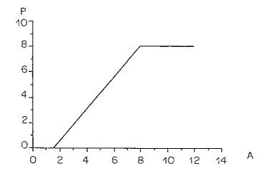
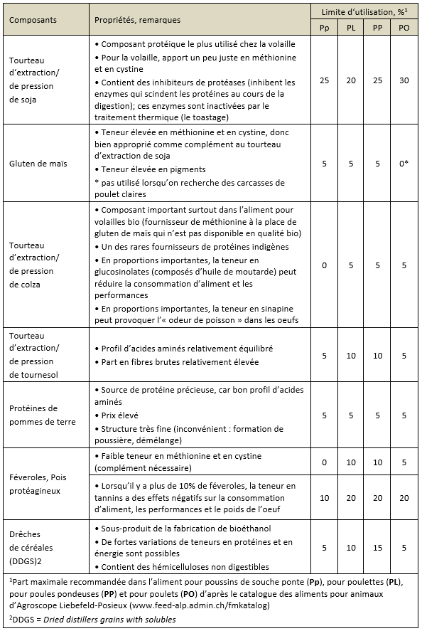

# Pratique de la formulation {#pratique}

##	Principe général

Le but de l’alimentation est de fournir aux animaux des aliments dont les caractéristiques permettent, dans les conditions d’élevage données, une production (de viande, d’œufs, de lait, de laines, …) assurant le bénéfice le plus élevé. Il s’agit donc de maximiser la différence entre recettes et dépenses.

Les recttes dépendent de la quantité des produits et de leur qualité. Il en est de même des dépenses pour lesquelles, l’alimentation représente la part majeure (environ 70%).

Le bénéfice maximum n’est pas forcément atteint avec la performance maximale. Il existe une infinité de solutions techniques envisageables pour associer des matières premières mais c’est la solution de l’optimum économique qui est recherché.

##	La notion de besoin

Le besoin en un nutriment donné est la quantité minimale du nutriment (par animal ou par unité de performence) à donner à l’animal et au-délà de laquelle le gain de poids vif (croissance) ou la quantité d’œufs produits, de lait produit, de laine produite, ..., n’augmente plus même si on augmente la quantité du nutriment apporté. Cette relation est représentée à la **Figure 5.1** avec un modèle de réponse linéaire-plateau.

La pente de la droite exprime l’inverse du besoin de production. L’intersection de la droite avec l’axe des abscisses représente le besoin d’entretien. Ce peut être la quantité de lysine nécessaire pour produire 1 g d’œuf, ou la quantité journalière nécessaire à l’entretien de 1 kg de poids vif.

Le besoin peut être autre que le gain de poids, la variable peut être l’indice de consommation, ou la masse corporelle non lipidique, ou la quantité de viande de la carcasse, ..., ou un critère économique tel que la marge (recettes – charges). Un besoin fait toujours référence à un objectif.

##	La formulation à moindre coût

Plusieurs méthodes d’optimisation existent mais la plus répandue demeure la programmation linéaire. Si l’on dispose d’un ensemble de **n** matières premières : $M_1$, $M_2$, ..., $M_i$, ..., $M_n$, il s’agit de déterminer leur taux d’incorporation $x_1$, $x_2$, ..., $x_i$, ..., $x_n$, de façon à satisfaire plusieurs objectifs dont :

-	le respect d’un certain nombre de conditions appellées contraintes de formulation, d’ordre nutritionnel, technologique ou commercial. Il s’agit soit de teneure en nutriments (*ex. teneur en protéines*), soit de limites d’incorporation d’ingrédient dues à la toxicité ou à l’inappétence. 

Ainsi, on peut être conduit à limiter l’introduction de certaines matières premières, ou au contraire à en imposer un minimum, de façon à assurer, par exemple, la solidité des granules ou la conservation des mélanges. On peut aussi être amené à limiter les taux d’incorporation de produits peu abondants sur le marché ou ceux pour lesquels on ne dispose pas de moyens de stockage suffisants, etc.

Ces contraintes sont de la forme : 

$$\sum_{i=1}^{n} a_{ij} * x_{ij} ≥ A_j$$

ou 

$$\sum_{i=1}^{n} a_{ij} * x_{ij} ≤ A_j$$

pour la caractéristique **j** fixée, où $a_{ij}$ est le coefficient technique représentant la quantité du nutriment **j** présente dans la matière **i** et $A_j$ est le besoin exprimé en concentration dans l’aliment.

Les contraintes d’incorporation sont de la forme $x_i ≥ L_{inc}$ ou bien $x_i ≤ L_{inc}$, où $L_{inc}$ est la limite d’incorporation de la matière première **i**.

-	Il faut ensuite minimizer le prix **C** (*le Coût*) du mélange. Si $c_1$, $c_2$, ..., $c_i$, ..., $c_n$ sont les prix des matières premières par unité de poids, on doit satisfaire à la relation : 

$$\sum_{i=1}^{n} c_{i} * x_{i} = C$$

- Enfin, par définition, 
$$0 < x_i < Q$$ 
et 
$$\sum_{i=1}^{n} x_{i} = Q$$

Il existe des logiciels capables de resoudre ce type de problèmes. La plupart ne cherche qu’à minimiser le prix du kg d’aliment, d’autres le prix de la calorie. La capacité des matrices liées au nombre de matières premières et de contraintes, détermine le choix du logiciel. En plus du calcul pour déteminer les quantités $x_i$, le nutritionniste est souvent amené à affectuer des calculs intermédiaires pour améliorer sa démarche. **Nous prendrons la volaille comme exemple.**

##	Démarche-type de détermination des besoins et des apports : cas des volailles

###	Les principales matières premières et les gammes d’aliments complets

Pour les élevages avicoles industriels, l'aliment distribué est un aliment composé complet fabriqué dans des usines spécialisées. En général, ces aliments sont à base de céréales *(maïs surtout, orge, sorgho, issues de céréales)*, tourteaux d'oléagineux *(soja et tournesol)*, farine de poisson, minéraux et premix *(minéraux et vitamines)*. 

Les différentes gammes d'aliments fabriqués sont fonction du type de production :

-	Les poulets de chair : aliments démarrage, croissance et finition

-	Les poules pondeuses d'oeufs de consommation et les poules reproductrices : aliments poulette démarrage, poulette élevage et pondeuse ou reproductrice, aliment reforme, ...

-	Dindes : aliments démarrage, croissance et finition 1 et 2

-	etc.

###	L’équilibre alimentaire

Les matières premières utilisées en alimentation des volailles peuvent se classer en 3 catégories :

- les premières appartiennent au groupe « énergie » et comprennent, outre les céréales, quelques racines et tubercules, mais aussi des sous-produits industriels de meuneries (sons et farines basses essentiellement pour ce qui concerne l’Afrique subsaharienne).

- Le deuxième groupe de matières premières alimentaires est le groupe protéines ou matières azotées. Il rassemble les tourteaux (sous-produits des huileries) et les farines de poissons fabriqués localement. 

- Enfin, les minéraux, les vitamines et un ensemble d’additifs.

Le maïs représente la céréale de choix pour l’alimentation des volailles. Sa valeur énergétique est très élevée et son amidon a une digestibilité élevée.

###	Besoins et normes nutritionnelles

Pour nourrir correctement les volailles, « le formulateur » a besoin de connaître :

-	le type de production dont il s’agit,

-	les conditions d’élevage des animaux,

-	et surtout, la composition des matières premières alimentaires utilisées pour composer l’aliment complet.

La notion de besoins nutritionnels découle naturellement de celle des besoins des animaux.
L’aliment est un mélange de matières premières énergétiques et azotées pour l’essentiel. Viennent s’y rajouter des additifs variables selon les espèces. Le formulateur doit respecter un certain nombre de contraintes.

Ces contraintes nutritionnelles ont dejà été estimées par plusieurs travaux de recherche, souvent proposées par le créateur de la souche (maisons de sélection). 

Les valeurs nutritives des ingrédients à combiner existent également dans des tables comme celle de l'INRA (**Figure 5.2**). Il faut spécialement et seulement veiller à exprimer bésoins nutritionnels des animaux et valeurs nutritives des aliments dans les mêmes unités.

Quelques exemples de normes nutritionnelles pour poulets de chair et poules pondeuses (**Tableaux 5.1 à 5.4**) :

**Tableau 5.1** Les normes en période de croissance de 1 à 28 jours

**Tableau 5.2** Période de finition de 29 jours à l’abattage

**Tableau 5.3** Normes pour poulettes

**Tableau 5.4** Normes pour pondeuses demi lourdes (poules rousses)

Mais le zootechnicien ou l'éleveur devrait pouvoir déterminer les besoins de ses animaux. Des formules de prévisions (modèles) existent. Un exemple simple : les besoins journaliers en énergie, protéines et acides aminés de la poule en période de ponte se calculent d’après les formules suivantes (Bessei, 1988):

- $Energie~(kJ/poule/jour) = (480 + 7 * [15 – Temp.~ambiante~(°C)]) * poids~vif~(kg^{0.75}) + 23 * GMQ~(g) + 9.6 * production~de~masse~d'oeuf~quotidienne~(g)$

- $Protéines~brutes~(g/poule/jour) = 3.5 * poids~vif~(kg^{0.75}) + 0.25 * masse~d‘oeuf~quotidienne~(g)$

- $Lysine~(mg/poule/jour) = 0.04 * poids~vif~(kg) + 8.6 * GMQ~(g) + 12.6 * production~de~masse~d’oeuf~quotidienne~(g)$

- $Méthionine~(mg/poule/jour) = 0.037 * poids~vif~(kg) + 4.5 * GMQ~(g) + 5.4 * production~de~masse~d’oeuf~quotidienne~(g)$

###	Règles générales à respecter lors de la formulation

Formuler une provende (*aliment pour animaux*) consiste à combiner les différentes matières premières dont on dispose pour obtenir un mélange assurant la satisfaction des besoins de l’animal tout en garantissant le prix le plus faible par kg d’aliment composé.

-	Il y a un intérêt à **utiliser un nombre important de matières premières** (de 7 à 12) pour équilibrer correctement une ration.

-	Il faut **s’approcher autant que possible des besoins recommandés** pour chaque catégorie de volailles et au cours des différents périodes d’élevage, **sans gaspiller les produits qui coûtent plus cher**.

-	On ne remplacera jamais une matière première par une autre sans **recalculer la composition de la provende**.

-	On ne fabriquera jamais un concentré minéral vitaminé soi-même _(pourquoi !!!)_ et on respectera les normes recommandées pour l’utilisation de CMV du commerce.

-	La **lysine** et la **méthionine** de synthèse sont souvent indispensables de même que les sources de **calcium** et de **phosphore**.

-	L’utilisation d’**huile végétale** ou de **graisses animales** permet d’obtenir un niveau énergétique élevé dans les rations.

-	Les **sons** _(riz, blé, ...)_ doivent toujours être utilisés (entre 7 et 12% de la ration) pour la régularisation du transit digestif et éviter les diarrhées et constipations.

### Limites d’utilisation de certaines matières premières

En raison de la présence de facteurs antinutritionnels, ou pour respecter une présentation optimale de la provende, ou parce que certains aliments confèrent des goûts à la chair et aux œufs, il est nécessaire de respecter un certain nombre de règles particulières pour l’incorporation des matières premières :

-	Les **céréales** : pas de limites d’utilisation à l’exception du sorgho rouge qui renferme des **tanins** (limite de 30 à 35% dans les rations, selon la teneur en tanins) ;

-	**Tourteau d’arachide** : ne pas dépasser 25% du mélange en raison de la présence d’**aflatoxine** ;

-	**Tourteau de coton** : ne pas dépasser 10% du mélange en raison de la présence de **gossypol** ;

-	**Tourteau de palmiste** : ne pas dépasser 20% du mélange (teneur élevée en fibres) ;

-	**Farine de poisson** : ne pas dépasser 5% du mélange car elle donne son goût aux œufs et à la viande de poulet, surtout si elle est grasse ;

-	**Farine basse de riz** : ne pas dépasser 40% du mélange pour limiter l’effet dépressif dû à son utilisation dans les rations ;

-	**Huile végétale** et **graisses animales** : ne pas dépasser 5% du mélange pour éviter la diarrhée.

**Tableau 5.5** Composants protéiques végétaux dans les aliments pour volailles, leurs propriétés et limites d’incorporation

### Démarche-type

#### Exemple 1

Soit 2 aliments :

- X concentrant 10% MAT et 3000 kcal EM/kg
- Y concentrant 30% MAT et 2000 kcal EM/kg

Constituer un mélange de 100 kg à 20% MAT et 2500 kcal EM/kg.

Les équations :

- 3000 X + 2000 Y = 2500
- 10 X + 30 Y = 20
- X + Y = 1 (ou 100 pour 100%)

Solution : 	X = Y = 0,5 (ou 50)

#### Exemple 2

Soit 2 aliments : 	

- X concentrant 10% MAT et 3000 kcal EM/kg
- Y concentrant 30% MAT et 2000 kcal EM/kg

Constituer un mélange de 100 kg à 20% MAT et 2600 kcal EM/kg.

Equations :

- 10 X + 30 Y = 20
- 3000 X + 2000 Y = 2600
- X + Y = 1 (ou 100)

Solution : normalement sans solution, alors on essaye de substituer cet ingrédient par un autre de la même catégorie et on refait les calculs !

#### Exemple 3

Soit 3 aliments : 

- X concentrant 10% MAT et 3000 kcal EM/kg
- Y concentrant 30% MAT et 2000 kcal EM/kg
- Z concentrant 20% MAT et 2700 kcal EM/kg

Constituer un mélange 100 kg à 20% MAT et 2600 kcal EM/kg.

Equations :

- 10 X + 30 Y + 20 Z = 20
- 3000 X + 2000 Y + 2700 Z = 2600
- X + Y + Z = 1 (ou 100)

Solution : X = Y = 0,25 (ou 25) et Z = 0,50 (ou 50)

**Remarques**

Si le système d’équations est avec égalité stricte, alors :

- Le nombre d’équations = au nombre de contraintes = au nombre d’aliments. 
- On n’obtient pas toujours de solution ou le nombre de solutions est réduit.

**Alternative :**

- X + Y + Z = 1 (qui est le mélange total, 100 kg ou 100%, ...)
- 10 X + 30 Y + 20 Z > 19 (taux de MAT qui doit être > à 19%)
- 10 X + 30 Y + 20 Z < 21 (taux de MAT qui doit être < à 21%)
- 3000 X + 2000 Y + 2700 Z > 2500 (teneur en énergie qui doit être > 2500 kcal EM/kg)
- 3000 X + 2000 Y + 2700 Z < 2700 (teneur en énergie qui doit être < 2700 kcal EM/kg)

**Avantages :**

-	Un grand nombre de solutions pour des performances identiques

-	Différentes recommandations alimentaires contre différents besoins alimentaires

-	Variabilité des aliments

-	Tient compte de la réalité de la production surtout la précision des pesées en usine.

Solutions : 

|Aliment|solution 1|solution 2|solution 3|solution 4|solution 5|...|solution X|
|:----|:----:|:----:|:----:|:----:|:----:|:----:|:----:|
|X|0.5|0.47|0.44|0.40|0.30|...|0|
|Y|0.5|0.43|0.36|0.30|0.20|...|0|
|Z|0|0.10|0.20|0.30|0,50|...|1|
|MAT|20|20.4|20.8|21|21|...|20|
|EM|2500|2500|2500|2510|2550|...|2700|

Grand nombre de solutions 😏! laquelle choisir ?

-	Voir la disponibilité des aliments X, Y et Z.

-	Tenir compte des limites d’incorporation (ex. Z < 0,35).

-	La contrainte de fabrication : ex. N’y a-t’il pas un ou des ingredients qui provoqueront la formation de mottes, de grumeaux, ...

PRIX : activité commerciale

-	Au niveau du fabricant : Bénéfice = Qté x (PV – PR)
-	Eleveur : Bénéfice = Qté produite x (PV’ – PR’); NB: ne pas s’embrouiller avec ça.
-	PR’ fonction de PV lui même fonction de PR;	NB: ne pas s’embrouiller avec ça.

La Formulation doit tenir compte du prix de revient :

-	Prix de X = 100, 
- Prix de Y = 150 
- et Prix de Z = 200.

|Aliment|solution 1|solution 2|solution 3|solution 4|solution 5|...|solution X|
|:----|:----:|:----:|:----:|:----:|:----:|:----:|:----:|
|X|0.5|0.47|0.44|0.40|0.30|...|0|
|Y|0.5|0.43|0.36|0.30|0.20|...|0|
|Z|0|0.10|0.20|0.30|0,50|...|1|
|MAT|20|20.4|20.8|21|21|...|20|
|EM|2500|2500|2500|2510|2550|...|2700|
|Prix|**125**|132|138|145|160|...|200|

Les modification de prix sur le marché. Certains prix peuvent avoir augmenté ou diminué. On peut, si non, s’exercer à varier les prix des ingrédients :

-	Prix de X précédent = 100, prix actuel 150
- Prix de Y = 150 (inchangé)
- et prix de Z précédent = 200, prix actuel 130.

|Aliment|solution 1|solution 2|solution 3|solution 4|solution 5|...|solution X|
|:----|:----:|:----:|:----:|:----:|:----:|:----:|:----:|
|X|0.5|0.47|0.44|0.40|0.30|...|0|
|Y|0.5|0.43|0.36|0.30|0.20|...|0|
|Z|0|0.10|0.20|0.30|0,50|...|1|
|MAT|20|20.4|20.8|21|21|...|20|
|EM|2500|2500|2500|2510|2550|...|2700|
|Prix|**150**|148|146|144|**140**|...|**130**|

Ainsi la formulation pour un **prix minimum** :

> Equation prix de la formule

- 150 X + 150 Y + 130 Z = minimum (équation objective)

> Equations des recommandations alimentaires

- 10 X + 30 Y + 20 Z > 19
- 10 X + 30 Y + 20 Z < 21
- 3000 X + 2000 Y + 2700 Z > 2500
- 3000 X + 2000 Y + 2700 Z < 2700

> Equations des contraintes technologiques

- X + Y + Z = 1
- X > 0,20
- Z < 0,50
- etc.

Plus le nombre d'équations s'accroit, il devient nécessaire d’utiliser un programme de formulation. Plusieurs logiciels existent souvent libres en ligne. La résolution est ausi possible sur feuille de calcul Excel avec le Solveur par la programmation linéaire. La programmation linéaire est la recherche de l’extremum (maximum ou minimum) d’une fonction linéaire sous un ensemble de contraintes linéaires.

L'extremum ici est le prix de revient minimum de la formule. Il est fonction du prix des ingrédients et	de leur taux d’incorporation dans la formule alimentaire.

Les contraintes sont les recommandations nutritionnelles, les taux d’incorporation, ...

##	Préparation du mélange

La préparation des aliments dans l’exploitation est réalisée en plusieurs étapes :

-	la pesée des matières premières : elle doit être précise.

- la	mouture : les matières premières fines (particules de 0.1 à 1.5 mm) peuvent être incorporés telles quelles dans le mélange (phosphore, craie, lysine, méthionine, CMV, sons, ...), les autres élements de la ration (céréales, tourteaux, ...) doivent être broyés avant d’être mélangés pour obtenir des particules grossières de 0.5 à 1.5 mm.

-	le pré-mélange : il consiste à mélanger toutes les matières premières que l’on doit incorporer en faibles quantités avec une partie des céréales moulues de manière à mieux les répartir dans le mélange final. Le pré mélange peut être réalisé simplement dans des bassines ou dans un tonneau désaxé mis en mouvement au mayen d’une manivelle (exemple : craie, phosphore, lysine, méthionine, CMV + une partie du mais).

-	le mélange : le pré-mélange est incorporé progressivement au reste des matières premières à l’aide d’un mélangeur (mélangeur subhorizontal, vertical, tonneau désaxé, ...) ou à la pelle sur surface bétonnée.

-	l'incorporation d’huile est réalisée en dernier lieu. Elle se fait progressivement et après un certain temps de mélange pour éviter la formation de petites boulettes.

##	Conseils pratiques

-	Utiliser toujours des matières premières de bonne qualité (éviter moisissures, terre, corps étrangers, …).

-	Peser correctement les matières premières.

-	Vérifier s’il n’y a pas de pertes au niveau du broyage, sinon réaliser la pesée des matières premières après mouture.

-	Eviter les pertes au niveau des pré-mélanges.

-	Incorporer progressivement le pré-mélange dans le mélange.

-	Incorporer en dernier lieu les matières grasses, de manière progressive et après avoir mélangé le reste pendant 10 minutes au moins.

-	Respecter les temps de mélange recommandés par les fabricants de mélangeurs (de 20 à 30 min.).

-	Vérifier la bonne répartition des ingrédients après avoir réalisé le mélange.

-	Utiliser toujours une main-d’œuvre qualifiée et expérimentée pour la préparation des aliments.

-	Lors de la fabrication, éviter la propagation des maladies d’un bâtiment à l’autre (grandes exploitations) par l’intermédiaire des sacs réutilisés : marquage et utilisation des sacs par bâtiment.

-	Pour la même raison, utiliser des sacs neufs pour les provendes et les remplacer régulièrement.

