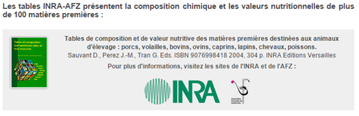
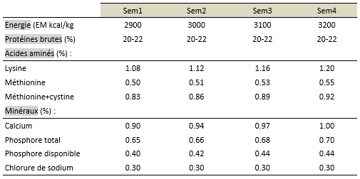
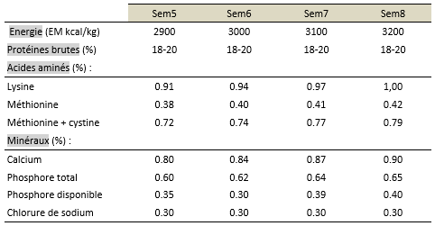
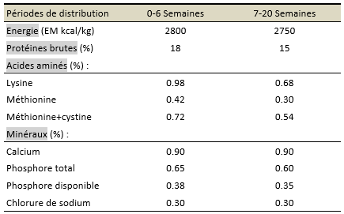
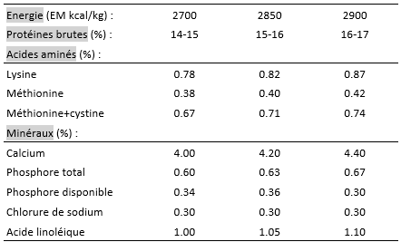

# Références {#references}

##	La formulation à moindre coût

Plusieurs méthodes d’optimisation existent mais la plus répandue demeure la programmation linéaire. Si l’on dispose d’un ensemble de **n** matières premières : $M_1$, $M_2$, ..., $M_i$, ..., $M_n$, il s’agit de déterminer leur taux d’incorporation $x_1$, $x_2$, ..., $x_i$, ..., $x_n$, de façon à satisfaire plusieurs objectifs dont :

-	le respect d’un certain nombre de conditions appellées contraintes de formulation, d’ordre nutritionnel, technologique ou commercial. Il s’agit soit de teneure en nutriments (*ex. teneur en protéines*), soit de limites d’incorporation d’ingrédient dues à la toxicité ou à l’inappétence. 

Ainsi, on peut être conduit à limiter l’introduction de certaines matières premières, ou au contraire à en imposer un minimum, de façon à assurer, par exemple, la solidité des granules ou la conservation des mélanges. On peut aussi être amené à limiter les taux d’incorporation de produits peu abondants sur le marché ou ceux pour lesquels on ne dispose pas de moyens de stockage suffisants, etc.

Ces contraintes sont de la forme : 

$$\sum_{i=1}^{n} a_{ij} * x_{ij} ≥ A_j$$
ou 

$$\sum_{i=1}^{n} a_{ij} * x_{ij} ≤ A_j$$

pour la caractéristique **j** fixée, où $a_{ij}$ est le coefficient technique représentant la quantité du nutriment **j** présente dans la matière **i** et $A_j$ est le besoin exprimé en concentration dans l’aliment.

Les contraintes d’incorporation sont de la forme $x_i ≥ L_{inc}$ ou bien $x_i ≤ L_{inc}$, où $L_{inc}$ est la limite d’incorporation de la matière première **i**.

-	Il faut ensuite minimizer le prix **C** (*le Coût*) du mélange. Si $c_1$, $c_2$, ..., $c_i$, ..., $c_n$ sont les prix des matières premières par unité de poids, on doit satisfaire à la relation : 

$$\sum_{i=1}^{n} c_{i} * x_{i} = C$$

- Enfin, par définition, $0 < x_i < Q$ et $\sum_{i=1}^{n} x_{i} = Q$

Il existe des logiciels capables de resoudre ce type de problèmes. La plupart ne cherche qu’à minimiser le prix du kg d’aliment, d’autres le prix de la calorie. La capacité des matrices liées au nombre de matières premières et de contraintes, détermine le choix du logiciel. En plus du calcul pour déteminer les quantités $x_i$, le nutritionniste est souvent amené à affectuer des calculs intermédiaires pour améliorer sa démarche.

**Nous prendrons la volaille comme exemple.**

##	Démarche-type de détermination des besoins et des apports : cas des volailles

###	Les principales matières premières et les gammes d’aliments complets

Pour les élevages avicoles industriels, l'aliment distribué est un aliment composé complet fabriqué dans des usines spécialisées. En général, ces aliments sont à base de céréales *(maïs surtout, orge, sorgho, issues de céréales)*, tourteaux d'oléagineux *(soja et tournesol)*, farine de poisson, minéraux et premix *(minéraux et vitamines)*. 

Les différentes gammes d'aliments fabriqués sont fonction du type de production :

-	Les poulets de chair : aliments démarrage, croissance et finition
-	Les poules pondeuses d'oeufs de consommation et les poules reproductrices : aliments poulette démarrage, poulette élevage et pondeuse ou reproductrice, aliment reforme, ...
-	Dindes : aliments démarrage, croissance et finition 1 et 2
-	etc.

###	L’équilibre alimentaire

Les matières premières utilisées en alimentation des volailles peuvent se classer en 3 catégories :

- les premières appartiennent au groupe « énergie » et comprennent, outre les céréales, quelques racines et tubercules, mais aussi des sous-produits industriels de meuneries (sons et farines basses essentiellement pour ce qui concerne l’Afrique subsaharienne).

- Le deuxième groupe de matières premières alimentaires est le groupe protéines ou matières azotées. Il rassemble les tourteaux (sous-produits des huileries) et les farines de poissons fabriqués localement. 

- Enfin, les minéraux, les vitamines et un ensemble d’additifs.

Le maïs représente la céréale de choix pour l’alimentation des volailles. Sa valeur énergétique est très élevée et son amidon a une digestibilité élevée.

###	Besoins et normes nutritionnelles

Pour nourrir correctement les volailles, « le formulateur » a besoin de connaître :
-	le type de production dont il s’agit,
-	les conditions d’élevage des animaux,
-	et surtout, la composition des matières premières alimentaires utilisées pour composer l’aliment complet.

La notion de besoins nutritionnels découle naturellement de celle des besoins des animaux.
L’aliment est un mélange de matières premières énergétiques et azotées pour l’essentiel. Viennent s’y rajouter des additifs variables selon les espèces. Le formulateur doit respecter un certain nombre de contraintes.

Ces contraintes nutritionnelles ont dejà été estimées par plusieurs travaux de recherche, souvent proposées par le créateur de la souche (maisons de sélection). 

Les valeurs nutritives des ingrédients à combiner existent également dans des tables comme celle de l'INRA (**Figure 5.2**). Il faut spécialement et seulement veiller à exprimer bésoins nutritionnels des animaux et valeurs nutritives des aliments dans les mêmes unités.

Quelques exemples de normes nutritionnelles pour poulets de chair et poules pondeuses (**Tableaux 5.1 à 5.4**) :

Mais le zootechnicien ou l'éleveur devrait pouvoir déterminer les besoins de ses animaux. Des formules de prévisions (modèles) existent. Un exemple simple : les besoins journaliers en énergie, protéines et acides aminés de la poule en période de ponte se calculent d’après les formules suivantes (Bessei, 1988) :